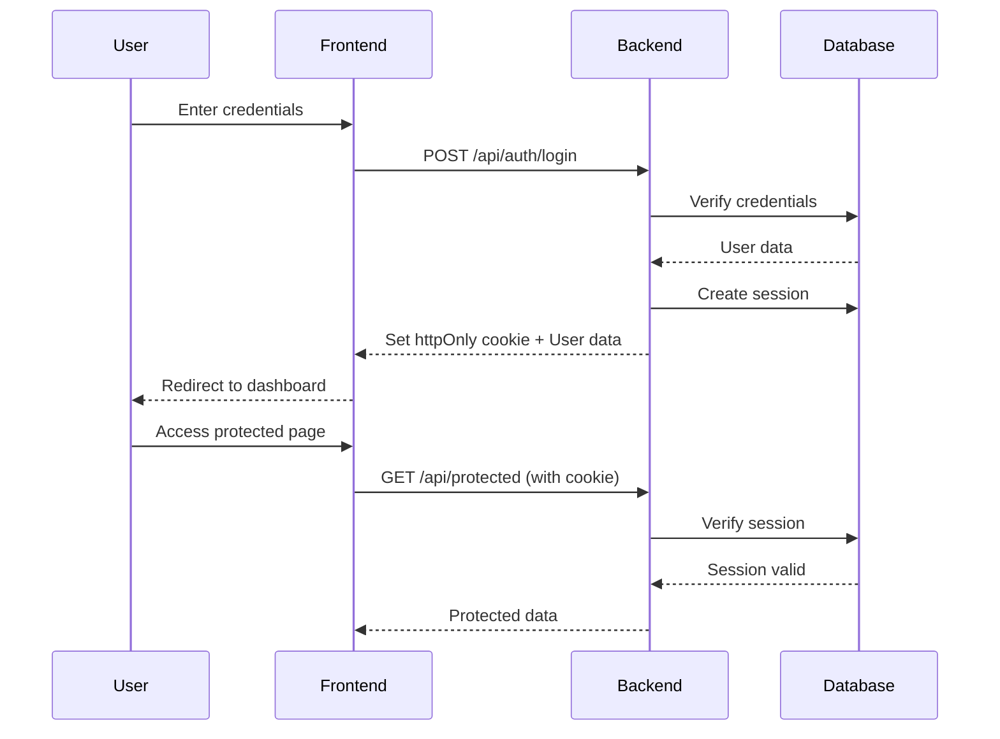

# Authentication API Documentation

## Overview

KaDong Tools Authentication API provides secure user authentication using JWT (JSON Web Tokens) with httpOnly cookies. All authentication endpoints are located at `/api/auth`.

**Base URL:** `http://localhost:5000` (Development) | `https://api.kadongtools.com` (Production)

**API Version:** 1.0.0

## Table of Contents

- [Authentication Flow](#authentication-flow)
- [Security](#security)
- [Rate Limiting](#rate-limiting)
- [Endpoints](#endpoints)
  - [POST /api/auth/register](#post-apiauthregister)
  - [POST /api/auth/login](#post-apiauthlogin)
  - [POST /api/auth/logout](#post-apiauthlogout)
  - [GET /api/auth/me](#get-apiauthme)
  - [POST /api/auth/refresh](#post-apiauthrefresh)
  - [POST /api/auth/forgot-password](#post-apiauthforgot-password)
  - [POST /api/auth/reset-password](#post-apiauthresetpassword)
- [Error Codes](#error-codes)

---

## Authentication Flow



---

## Security

### Password Requirements

- **Minimum length:** 8 characters
- **Must contain:**
  - At least 1 uppercase letter (A-Z)
  - At least 1 lowercase letter (a-z)
  - At least 1 number (0-9)

### Password Storage

- Passwords are hashed using **bcrypt** with 10 salt rounds
- Original passwords are **never** stored
- Password hashes are **never** returned in API responses

### Token Security

- **JWT tokens** signed with HS256 algorithm
- Stored in **httpOnly cookies** (not accessible via JavaScript)
- **SameSite=Strict** attribute prevents CSRF attacks
- **Secure flag** enabled in production (HTTPS only)
- **7-day expiration** (default) or **30-day** (with rememberMe)

### Session Management

- Sessions stored in PostgreSQL database
- Sessions can be revoked (logout invalidates token)
- Expired sessions automatically cleaned up

---

## Rate Limiting

To prevent abuse, the following rate limits are enforced:

| Endpoint | Limit | Window |
|----------|-------|--------|
| POST /api/auth/register | 3 requests | 15 minutes |
| POST /api/auth/login | 5 requests | 15 minutes |
| POST /api/auth/forgot-password | 3 requests | 1 hour |
| Other endpoints | No limit | - |

**Rate limit response:**
```json
{
  "success": false,
  "error": {
    "code": "TOO_MANY_REQUESTS",
    "message": "Too many login attempts. Please try again later.",
    "retryAfter": "15 minutes"
  }
}
```

---

## Endpoints

### POST /api/auth/register

Register a new user account.

**Rate Limit:** 3 requests per 15 minutes

#### Request

**Headers:**
```
Content-Type: application/json
```

**Body:**
```json
{
  "email": "user@example.com",
  "password": "SecurePass123",
  "name": "John Doe"
}
```

**Parameters:**

| Field | Type | Required | Description |
|-------|------|----------|-------------|
| email | string | Yes | Valid email address |
| password | string | Yes | Password meeting requirements |
| name | string | No | User's display name |

#### Response

**Success (201 Created):**
```json
{
  "success": true,
  "data": {
    "user": {
      "id": 123,
      "email": "user@example.com",
      "name": "John Doe",
      "role": "user",
      "emailVerified": false,
      "createdAt": "2025-11-13T10:30:00.000Z"
    }
  },
  "message": "Đăng ký thành công"
}
```

**Cookies Set:**
```
token=<jwt_token>; HttpOnly; Secure; SameSite=Strict; Max-Age=604800
```

#### Errors

**400 Bad Request - Invalid Email:**
```json
{
  "success": false,
  "error": {
    "code": "VALIDATION_ERROR",
    "message": "Email không hợp lệ",
    "field": "email"
  }
}
```

**400 Bad Request - Weak Password:**
```json
{
  "success": false,
  "error": {
    "code": "VALIDATION_ERROR",
    "message": "Mật khẩu phải có ít nhất 8 ký tự, bao gồm chữ hoa, chữ thường và số",
    "field": "password"
  }
}
```

**400 Bad Request - Email Already Exists:**
```json
{
  "success": false,
  "error": {
    "code": "EMAIL_EXISTS",
    "message": "Email đã được sử dụng",
    "field": "email"
  }
}
```

---

### POST /api/auth/login

Authenticate user and create session.

**Rate Limit:** 5 requests per 15 minutes

#### Request

**Headers:**
```
Content-Type: application/json
```

**Body:**
```json
{
  "email": "user@example.com",
  "password": "SecurePass123",
  "rememberMe": false
}
```

**Parameters:**

| Field | Type | Required | Default | Description |
|-------|------|----------|---------|-------------|
| email | string | Yes | - | User's email |
| password | string | Yes | - | User's password |
| rememberMe | boolean | No | false | Extend session to 30 days |

#### Response

**Success (200 OK):**
```json
{
  "success": true,
  "data": {
    "user": {
      "id": 123,
      "email": "user@example.com",
      "name": "John Doe",
      "role": "user",
      "emailVerified": true,
      "createdAt": "2025-11-13T10:30:00.000Z"
    },
    "expiresIn": "7d"
  },
  "message": "Đăng nhập thành công"
}
```

**With rememberMe=true:**
```json
{
  "data": {
    "expiresIn": "30d"
  }
}
```

**Cookies Set:**
```
token=<jwt_token>; HttpOnly; Secure; SameSite=Strict; Max-Age=604800
```

#### Errors

**401 Unauthorized - Invalid Credentials:**
```json
{
  "success": false,
  "error": {
    "code": "INVALID_CREDENTIALS",
    "message": "Email hoặc mật khẩu không đúng"
  }
}
```

Note: Generic error message for security (doesn't reveal if email exists).

---

### POST /api/auth/logout

Logout user and revoke session.

#### Request

**Headers:**
```
Cookie: token=<jwt_token>
```

**Body:** None

#### Response

**Success (200 OK):**
```json
{
  "success": true,
  "message": "Đăng xuất thành công"
}
```

**Cookies Set:**
```
token=; HttpOnly; Secure; SameSite=Strict; Max-Age=0
```
(Cookie cleared)

#### Errors

**401 Unauthorized - No Token:**
```json
{
  "success": false,
  "error": {
    "code": "UNAUTHORIZED",
    "message": "Vui lòng đăng nhập"
  }
}
```

---

### GET /api/auth/me

Get current authenticated user's profile.

#### Request

**Headers:**
```
Cookie: token=<jwt_token>
```

#### Response

**Success (200 OK):**
```json
{
  "success": true,
  "data": {
    "user": {
      "id": 123,
      "email": "user@example.com",
      "name": "John Doe",
      "role": "user",
      "emailVerified": true,
      "createdAt": "2025-11-13T10:30:00.000Z",
      "updatedAt": "2025-11-13T10:30:00.000Z"
    }
  }
}
```

#### Errors

**401 Unauthorized:**
```json
{
  "success": false,
  "error": {
    "code": "UNAUTHORIZED",
    "message": "Vui lòng đăng nhập"
  }
}
```

---

### POST /api/auth/refresh

Refresh JWT token (renew session).

#### Request

**Headers:**
```
Cookie: token=<jwt_token>
```

**Body:** None

#### Response

**Success (200 OK):**
```json
{
  "success": true,
  "data": {
    "expiresIn": "7d"
  },
  "message": "Token đã được làm mới"
}
```

**Cookies Set:**
```
token=<new_jwt_token>; HttpOnly; Secure; SameSite=Strict; Max-Age=604800
```

#### Errors

**401 Unauthorized:**
```json
{
  "success": false,
  "error": {
    "code": "UNAUTHORIZED",
    "message": "Token không hợp lệ hoặc đã hết hạn"
  }
}
```

---

### POST /api/auth/forgot-password

Request password reset token via email.

**Rate Limit:** 3 requests per hour

#### Request

**Headers:**
```
Content-Type: application/json
```

**Body:**
```json
{
  "email": "user@example.com"
}
```

**Parameters:**

| Field | Type | Required | Description |
|-------|------|----------|-------------|
| email | string | Yes | User's email address |

#### Response

**Success (200 OK):**
```json
{
  "success": true,
  "message": "Đã gửi link đặt lại mật khẩu đến email của bạn"
}
```

Note: Always returns success (even if email doesn't exist) for security.

#### Email Sent

Subject: **Đặt lại mật khẩu KaDong Tools**

Content:
```
Xin chào,

Bạn đã yêu cầu đặt lại mật khẩu cho tài khoản KaDong Tools.

Nhấp vào link sau để đặt lại mật khẩu (có hiệu lực trong 1 giờ):
https://kadongtools.com/reset-password?token=<reset_token>

Nếu bạn không yêu cầu đặt lại mật khẩu, vui lòng bỏ qua email này.

Trân trọng,
KaDong Tools Team
```

#### Errors

**400 Bad Request - Invalid Email:**
```json
{
  "success": false,
  "error": {
    "code": "VALIDATION_ERROR",
    "message": "Email không hợp lệ",
    "field": "email"
  }
}
```

---

### POST /api/auth/reset-password

Reset password using token from email.

#### Request

**Headers:**
```
Content-Type: application/json
```

**Body:**
```json
{
  "token": "<reset_token_from_email>",
  "newPassword": "NewSecurePass123"
}
```

**Parameters:**

| Field | Type | Required | Description |
|-------|------|----------|-------------|
| token | string | Yes | Reset token from email |
| newPassword | string | Yes | New password meeting requirements |

#### Response

**Success (200 OK):**
```json
{
  "success": true,
  "message": "Mật khẩu đã được đặt lại thành công"
}
```

#### Errors

**400 Bad Request - Invalid Token:**
```json
{
  "success": false,
  "error": {
    "code": "INVALID_TOKEN",
    "message": "Link đặt lại mật khẩu không hợp lệ hoặc đã hết hạn",
    "field": "token"
  }
}
```

**400 Bad Request - Weak Password:**
```json
{
  "success": false,
  "error": {
    "code": "VALIDATION_ERROR",
    "message": "Mật khẩu phải có ít nhất 8 ký tự, bao gồm chữ hoa, chữ thường và số",
    "field": "newPassword"
  }
}
```

**400 Bad Request - Token Already Used:**
```json
{
  "success": false,
  "error": {
    "code": "TOKEN_USED",
    "message": "Link đặt lại mật khẩu đã được sử dụng",
    "field": "token"
  }
}
```

---

## Error Codes

### Standard Error Response Format

```json
{
  "success": false,
  "error": {
    "code": "ERROR_CODE",
    "message": "Human-readable error message",
    "field": "fieldName"
  }
}
```

### Error Code Reference

| Code | HTTP Status | Description |
|------|-------------|-------------|
| VALIDATION_ERROR | 400 | Input validation failed |
| EMAIL_EXISTS | 400 | Email already registered |
| INVALID_CREDENTIALS | 401 | Wrong email or password |
| UNAUTHORIZED | 401 | Not authenticated |
| INVALID_TOKEN | 400 | Invalid or expired reset token |
| TOKEN_USED | 400 | Reset token already used |
| TOO_MANY_REQUESTS | 429 | Rate limit exceeded |
| INTERNAL_ERROR | 500 | Server error |

---

## Code Examples

### JavaScript/Fetch

**Register:**
```javascript
const response = await fetch('http://localhost:5000/api/auth/register', {
  method: 'POST',
  headers: {
    'Content-Type': 'application/json'
  },
  credentials: 'include', // Important: include cookies
  body: JSON.stringify({
    email: 'user@example.com',
    password: 'SecurePass123',
    name: 'John Doe'
  })
})

const data = await response.json()
console.log(data.data.user)
```

**Login:**
```javascript
const response = await fetch('http://localhost:5000/api/auth/login', {
  method: 'POST',
  headers: {
    'Content-Type': 'application/json'
  },
  credentials: 'include',
  body: JSON.stringify({
    email: 'user@example.com',
    password: 'SecurePass123',
    rememberMe: true
  })
})

const data = await response.json()
console.log(data.data.user)
```

**Get Current User:**
```javascript
const response = await fetch('http://localhost:5000/api/auth/me', {
  method: 'GET',
  credentials: 'include' // Sends cookie automatically
})

const data = await response.json()
console.log(data.data.user)
```

**Logout:**
```javascript
const response = await fetch('http://localhost:5000/api/auth/logout', {
  method: 'POST',
  credentials: 'include'
})

const data = await response.json()
console.log(data.message) // "Đăng xuất thành công"
```

### React Example

```jsx
import { useAuth } from './contexts/AuthContext'

function LoginForm() {
  const { login } = useAuth()
  const [formData, setFormData] = useState({
    email: '',
    password: '',
    rememberMe: false
  })

  const handleSubmit = async (e) => {
    e.preventDefault()
    
    try {
      await login(formData.email, formData.password, formData.rememberMe)
      navigate('/dashboard')
    } catch (error) {
      setError(error.message)
    }
  }

  return (
    <form onSubmit={handleSubmit}>
      {/* form fields */}
    </form>
  )
}
```

---

## Testing

### Test Credentials (Development Only)

**Admin User:**
- Email: `admin@kadong.com`
- Password: `KaDong2024!`

**Regular User:**
- Email: `user@kadong.com`
- Password: `KaDong2024!`

**Guest User:**
- Email: `guest@kadong.com`
- Password: `KaDong2024!`

### Postman Collection

Import the Postman collection for easy testing: [Download Collection](./postman/KaDongTools_Auth_API.postman_collection.json)

---

## Changelog

### Version 1.0.0 (2025-11-13)

- Initial authentication system
- User registration with email/password
- Login with JWT tokens
- Session management
- Password reset flow
- Rate limiting
- Security best practices (bcrypt, httpOnly cookies, CSRF protection)

---

## Support

For issues or questions:
- GitHub Issues: [github.com/kadongtools/issues](https://github.com/kadongtools/issues)
- Email: support@kadongtools.com

---

**Last Updated:** November 13, 2025  
**API Version:** 1.0.0
