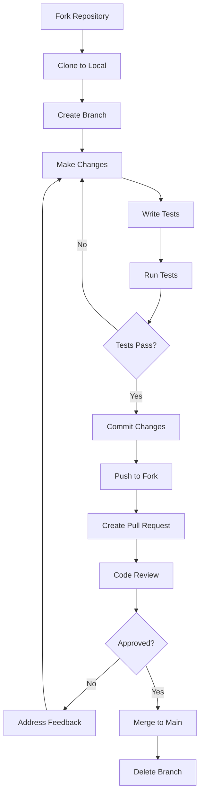

# 🤝 08. Contribution Guide - Hướng dẫn Đóng góp

## 8.1 Getting Started

### Prerequisites

- ✅ Node.js 18+ installed
- ✅ PostgreSQL 13+ installed
- ✅ Git installed
- ✅ Code editor (VS Code recommended)
- ✅ GitHub account

---

## 8.2 Development Setup

### 1. Fork & Clone Repository

```bash
# Fork repository trên GitHub (click Fork button)

# Clone forked repository
git clone https://github.com/YOUR_USERNAME/KaDongSite.git
cd KaDongSite

# Add upstream remote
git remote add upstream https://github.com/ORIGINAL_OWNER/KaDongSite.git

# Verify remotes
git remote -v
# origin    https://github.com/YOUR_USERNAME/KaDongSite.git (fetch)
# origin    https://github.com/YOUR_USERNAME/KaDongSite.git (push)
# upstream  https://github.com/ORIGINAL_OWNER/KaDongSite.git (fetch)
# upstream  https://github.com/ORIGINAL_OWNER/KaDongSite.git (push)
```

### 2. Install Dependencies

```bash
# Backend
cd backend
npm install

# Frontend
cd ../frontend
npm install
```

### 3. Setup Database

```bash
# Create database
psql -U postgres -c "CREATE DATABASE kadong_tools_dev"

# Copy environment file
cd backend
copy .env.example .env

# Update .env with your database credentials

# Run migrations
npm run db:migrate:up

# Seed data
npm run db:seed
```

### 4. Run Development Servers

```bash
# Terminal 1 - Backend
cd backend
npm run dev

# Terminal 2 - Frontend
cd frontend
npm run dev
```

---

## 8.3 Branching Strategy

### Branch Naming Convention

```
<type>/<short-description>

Types:
- feature/  : New feature
- fix/      : Bug fix
- docs/     : Documentation changes
- refactor/ : Code refactoring
- test/     : Adding tests
- chore/    : Maintenance tasks
```

**Examples**:
```bash
feature/add-dark-mode
fix/notes-delete-bug
docs/update-api-guide
refactor/optimize-queries
test/add-unit-tests
chore/update-dependencies
```

### Creating a Branch

```bash
# Sync with upstream
git checkout main
git pull upstream main

# Create new branch
git checkout -b feature/add-dark-mode

# Push branch to your fork
git push origin feature/add-dark-mode
```

---

## 8.4 Code Style Guidelines

### JavaScript/React Style

**Use ESLint + Prettier**:

```bash
# Install ESLint & Prettier
npm install --save-dev eslint prettier eslint-config-prettier

# Run linter
npm run lint

# Fix auto-fixable issues
npm run lint:fix

# Format code
npm run format
```

**Code Style Rules**:

```javascript
// ✅ GOOD
const userName = 'Ka'
const isActive = true

function getUserById(id) {
  return users.find(user => user.id === id)
}

const NoteCard = ({ title, content, color }) => {
  const [isEditing, setIsEditing] = useState(false)
  
  return (
    <div className={`note-card bg-${color}`}>
      <h3>{title}</h3>
      <p>{content}</p>
    </div>
  )
}

// ❌ BAD
const user_name = 'Ka'  // Use camelCase
const active = true     // Use is/has prefix for booleans

function getUser(id) {  // Be specific: getUserById
  return users.find(function(user) {  // Use arrow functions
    return user.id === id
  })
}

const NoteCard = (props) => {  // Destructure props
  return <div className={"note-card bg-" + props.color}></div>  // Use template literals
}
```

### Commit Message Convention

**Format**: `<type>(<scope>): <subject>`

**Types**:
- `feat`: New feature
- `fix`: Bug fix
- `docs`: Documentation
- `style`: Code formatting
- `refactor`: Code refactoring
- `test`: Adding tests
- `chore`: Maintenance

**Examples**:
```bash
feat(notes): add search functionality
fix(countdown): correct days calculation
docs(api): update authentication guide
style(frontend): format with prettier
refactor(database): optimize query performance
test(notes): add unit tests for CRUD operations
chore(deps): update dependencies
```

**Good Commit Messages**:
```bash
✅ feat(notes): add color filter dropdown
✅ fix(auth): resolve token expiration bug
✅ docs(wiki): add deployment guide
✅ refactor(api): extract validation middleware
```

**Bad Commit Messages**:
```bash
❌ update code
❌ fix bug
❌ changes
❌ wip
```

---

## 8.5 Making Changes

### 1. Write Code

```bash
# Create/edit files
# Follow code style guidelines
# Add comments for complex logic
```

### 2. Test Changes

```bash
# Run backend tests
cd backend
npm test

# Run frontend tests
cd frontend
npm test

# Manual testing
# - Test in browser
# - Test API with Postman/curl
# - Check console for errors
```

### 3. Add/Update Tests

```javascript
// backend/tests/notes.test.js
describe('Notes API', () => {
  it('should create a new note', async () => {
    const response = await request(app)
      .post('/api/notes')
      .send({
        title: 'Test Note',
        content: 'Test content'
      })
      .expect(201)
    
    expect(response.body.success).toBe(true)
    expect(response.body.data.title).toBe('Test Note')
  })
})
```

### 4. Update Documentation

```markdown
# If you added a new feature:
1. Update API documentation (05_API_Documentation.md)
2. Update Frontend overview if UI changed (06_FrontendOverview.md)
3. Add examples to README.md

# If you fixed a bug:
1. Add to Troubleshooting (09_Troubleshooting.md)
2. Update Changelog (10_Changelog.md)
```

---

## 8.6 Submitting Pull Request

### 1. Commit Changes

```bash
# Stage changes
git add .

# Commit with descriptive message
git commit -m "feat(notes): add search functionality"

# Push to your fork
git push origin feature/add-search
```

### 2. Create Pull Request

1. Go to your fork on GitHub
2. Click "Compare & pull request"
3. Fill in PR template:

```markdown
## Description
Brief description of changes

## Type of Change
- [ ] Bug fix
- [x] New feature
- [ ] Documentation update
- [ ] Code refactoring

## Changes Made
- Added search bar to Notes page
- Implemented search functionality
- Added tests for search feature

## Testing
- [x] Tested locally
- [x] Added unit tests
- [x] Tested on multiple browsers

## Screenshots (if UI changes)
[Add screenshots here]

## Checklist
- [x] Code follows style guidelines
- [x] Self-review completed
- [x] Comments added for complex code
- [x] Documentation updated
- [x] Tests added/updated
- [x] No breaking changes
```

### 3. PR Review Process

**What happens next**:
1. ✅ Automated checks run (linting, tests)
2. ✅ Maintainers review code
3. ✅ You address feedback (if any)
4. ✅ PR gets merged!

**Addressing Feedback**:
```bash
# Make requested changes
# Commit changes
git add .
git commit -m "fix: address PR feedback"

# Push to same branch
git push origin feature/add-search

# PR updates automatically
```

---

## 8.7 Code Review Guidelines

### For Contributors

**Before requesting review**:
- [ ] Code is self-documented
- [ ] No console.log() left in code
- [ ] No commented-out code
- [ ] Tests pass
- [ ] Documentation updated

**Responding to feedback**:
- ✅ Be respectful and open to suggestions
- ✅ Ask questions if unclear
- ✅ Make requested changes promptly
- ✅ Push new commits (don't force push)

### For Reviewers

**What to check**:
- [ ] Code follows style guide
- [ ] Logic is correct
- [ ] No security vulnerabilities
- [ ] Tests cover new code
- [ ] Documentation is clear
- [ ] No breaking changes

**Providing feedback**:
```markdown
✅ GOOD:
"This function could be optimized by using Array.filter() instead of forEach(). 
Example: `items.filter(item => item.active)`"

❌ BAD:
"This is wrong, rewrite it"
```

---

## 8.8 Development Workflow



---

## 8.9 Project-Specific Conventions

### Database Changes

**Always create migration files**:

```bash
# Create new migration
cd backend/database/migrations

# File naming: XXX_up_description.sql
# Example: 002_up_add_tags_table.sql

# Add both UP and DOWN migrations
002_up_add_tags_table.sql
002_down_drop_tags_table.sql
```

**Example UP migration**:
```sql
-- 002_up_add_tags_table.sql
CREATE TABLE tags (
    id UUID PRIMARY KEY DEFAULT uuid_generate_v4(),
    name VARCHAR(50) UNIQUE NOT NULL,
    color VARCHAR(50) DEFAULT 'gray',
    created_at TIMESTAMP DEFAULT CURRENT_TIMESTAMP
);

CREATE INDEX idx_tags_name ON tags(name);
```

**Example DOWN migration**:
```sql
-- 002_down_drop_tags_table.sql
DROP TABLE IF EXISTS tags;
```

### API Endpoint Naming

```javascript
// ✅ GOOD - RESTful conventions
GET    /api/notes           // Get all notes
GET    /api/notes/:id       // Get single note
POST   /api/notes           // Create note
PUT    /api/notes/:id       // Update note
DELETE /api/notes/:id       // Delete note

// ❌ BAD
GET    /api/getAllNotes
POST   /api/createNote
GET    /api/note/:id
```

### Component File Structure

```jsx
// ✅ GOOD - Organized imports
import React, { useState, useEffect } from 'react'  // React
import { motion } from 'framer-motion'               // External libs
import { useNavigate } from 'react-router-dom'

import Header from '../components/Header'            // Internal components
import NoteCard from '../components/NoteCard'

import { api } from '../utils/api'                   // Utils
import { formatDate } from '../utils/helpers'

import './NotesTool.css'                             // Styles

// Component code...
```

---

## 8.10 Testing Standards

### Unit Tests

**Required for**:
- ✅ API endpoints
- ✅ Utility functions
- ✅ Database queries
- ✅ React hooks

**Example**:
```javascript
// utils/helpers.test.js
import { formatDate } from './helpers'

describe('formatDate', () => {
  it('should format date correctly', () => {
    const date = new Date('2024-11-11')
    expect(formatDate(date)).toBe('Nov 11, 2024')
  })
  
  it('should handle invalid date', () => {
    expect(formatDate(null)).toBe('Invalid Date')
  })
})
```

### Integration Tests

**Required for**:
- ✅ API routes with database
- ✅ Authentication flow
- ✅ CRUD operations

**Example**:
```javascript
// routes/notes.test.js
describe('POST /api/notes', () => {
  it('should create note and save to database', async () => {
    const response = await request(app)
      .post('/api/notes')
      .send({ title: 'Test', content: 'Content' })
      .expect(201)
    
    // Verify in database
    const note = await query('SELECT * FROM notes WHERE id = $1', [response.body.data.id])
    expect(note.rows[0].title).toBe('Test')
  })
})
```

---

## 8.11 Issue Reporting

### Creating Good Issues

**Bug Report Template**:
```markdown
## Bug Description
Clear description of the bug

## Steps to Reproduce
1. Go to Notes page
2. Click "Add Note"
3. Leave title empty
4. Click "Save"

## Expected Behavior
Should show validation error

## Actual Behavior
App crashes with "Cannot read property 'title'"

## Environment
- OS: Windows 11
- Browser: Chrome 119
- Node version: 18.17.0

## Screenshots
[Add screenshot]
```

**Feature Request Template**:
```markdown
## Feature Description
Brief description of proposed feature

## Use Case
Why is this feature needed?

## Proposed Solution
How should it work?

## Alternatives Considered
Other approaches you've thought of

## Additional Context
Any other information
```

---

## 8.12 Getting Help

### Resources

- **Documentation**: Read Wiki pages
- **Issues**: Check existing issues on GitHub
- **Discussions**: GitHub Discussions tab
- **Discord/Slack**: Join community chat (if available)

### Asking Questions

**Good question**:
```markdown
## What I'm Trying to Do
Add pagination to Notes API

## What I've Tried
- Implemented `LIMIT` and `OFFSET` in SQL query
- Added `page` parameter to route

## Problem
Getting incorrect total pages count

## Code
[Paste relevant code]
```

**Bad question**:
```markdown
"API not working help"
```

---

## 📎 Related Links

- **[Setup Guide](03_SetupAndInstallation.md)** - Development setup
- **[Project Structure](02_ProjectStructure.md)** - Codebase organization
- **[API Documentation](05_API_Documentation.md)** - API endpoints
- **[Troubleshooting](09_Troubleshooting.md)** - Common issues

---

## 🎉 Thank You!

Thank you for contributing to KaDong Tools! Every contribution, no matter how small, helps make this project better. 💕

---

**Version**: 1.0  
**Last Updated**: November 11, 2024  
**Author**: KaDong Team
