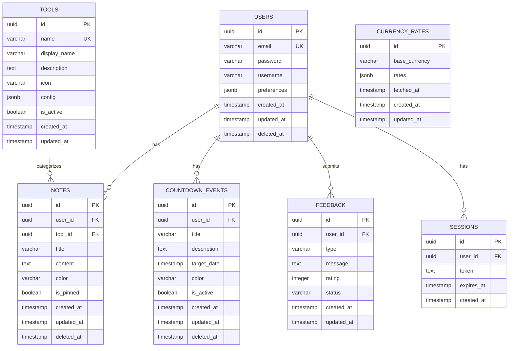

# 🗄️ 04. Database Schema - Cấu trúc Database

## 4.1 Tổng quan Database

**Database Type**: PostgreSQL 13+  
**Connection**: Connection pooling với max 20 connections  
**Character Set**: UTF-8  
**Primary Keys**: UUID v4 (non-enumerable, secure)  
**Soft Deletes**: Sử dụng `deleted_at` column  
**Audit Fields**: `created_at`, `updated_at` trên mọi tables

---

## 4.2 Entity Relationship Diagram (ERD)



---

## 4.3 Chi tiết Tables

### 📋 Table: `users`

**Mô tả**: Lưu thông tin người dùng (Ka và Dong)

| Column | Type | Constraints | Description |
|--------|------|-------------|-------------|
| `id` | UUID | PRIMARY KEY | User ID (UUID v4) |
| `email` | VARCHAR(255) | UNIQUE, NOT NULL | Email đăng nhập |
| `password` | VARCHAR(255) | NOT NULL | Bcrypt hashed password |
| `username` | VARCHAR(100) | NOT NULL | Tên hiển thị |
| `preferences` | JSONB | DEFAULT '{}' | User preferences (theme, language) |
| `created_at` | TIMESTAMP | DEFAULT NOW() | Thời gian tạo |
| `updated_at` | TIMESTAMP | DEFAULT NOW() | Thời gian cập nhật |
| `deleted_at` | TIMESTAMP | NULL | Soft delete timestamp |

**Indexes**:
- PRIMARY KEY on `id`
- UNIQUE INDEX on `email`
- INDEX on `deleted_at` for soft delete queries

**Example Row**:
```json
{
  "id": "a1b2c3d4-e5f6-7890-abcd-ef1234567890",
  "email": "ka@example.com",
  "password": "$2b$10$abcdefghijklmnopqrstuvwxyz...",
  "username": "Ka",
  "preferences": {
    "theme": "pastel-pink",
    "language": "vi",
    "notifications": true
  },
  "created_at": "2024-01-01T10:00:00Z",
  "updated_at": "2024-11-11T15:30:00Z",
  "deleted_at": null
}
```

---

### 📝 Table: `notes`

**Mô tả**: Lưu các ghi chú cá nhân

| Column | Type | Constraints | Description |
|--------|------|-------------|-------------|
| `id` | UUID | PRIMARY KEY | Note ID |
| `user_id` | UUID | FOREIGN KEY → users(id), NOT NULL | User sở hữu note |
| `tool_id` | UUID | FOREIGN KEY → tools(id) | Tool liên quan (optional) |
| `title` | VARCHAR(200) | NOT NULL | Tiêu đề note |
| `content` | TEXT | NOT NULL | Nội dung note |
| `color` | VARCHAR(50) | DEFAULT 'pink' | Màu sắc (pink/purple/mint) |
| `is_pinned` | BOOLEAN | DEFAULT false | Ghim lên đầu |
| `created_at` | TIMESTAMP | DEFAULT NOW() | Thời gian tạo |
| `updated_at` | TIMESTAMP | DEFAULT NOW() | Thời gian cập nhật |
| `deleted_at` | TIMESTAMP | NULL | Soft delete timestamp |

**Indexes**:
- PRIMARY KEY on `id`
- INDEX on `user_id`
- INDEX on `tool_id`
- INDEX on `created_at DESC` for sorting
- INDEX on `is_pinned, created_at DESC` for pinned notes

**Foreign Keys**:
- `user_id` → `users(id)` ON DELETE CASCADE
- `tool_id` → `tools(id)` ON DELETE SET NULL

**Example Row**:
```json
{
  "id": "note-uuid-1234",
  "user_id": "user-ka-uuid",
  "tool_id": "tool-notes-uuid",
  "title": "Shopping List",
  "content": "- Milk\n- Bread\n- Eggs",
  "color": "mint",
  "is_pinned": true,
  "created_at": "2024-11-10T09:00:00Z",
  "updated_at": "2024-11-11T10:30:00Z",
  "deleted_at": null
}
```

---

### ⏱️ Table: `countdown_events`

**Mô tả**: Lưu các sự kiện đếm ngược (ngày kỷ niệm, ngày cưới, v.v.)

| Column | Type | Constraints | Description |
|--------|------|-------------|-------------|
| `id` | UUID | PRIMARY KEY | Event ID |
| `user_id` | UUID | FOREIGN KEY → users(id), NOT NULL | User sở hữu event |
| `title` | VARCHAR(200) | NOT NULL | Tên sự kiện |
| `description` | TEXT | NULL | Mô tả chi tiết |
| `target_date` | TIMESTAMP | NOT NULL | Ngày mục tiêu |
| `color` | VARCHAR(50) | DEFAULT 'pink' | Màu sắc hiển thị |
| `is_active` | BOOLEAN | DEFAULT true | Đang hoạt động |
| `created_at` | TIMESTAMP | DEFAULT NOW() | Thời gian tạo |
| `updated_at` | TIMESTAMP | DEFAULT NOW() | Thời gian cập nhật |
| `deleted_at` | TIMESTAMP | NULL | Soft delete timestamp |

**Indexes**:
- PRIMARY KEY on `id`
- INDEX on `user_id`
- INDEX on `target_date` for date queries
- INDEX on `is_active` for filtering

**Foreign Keys**:
- `user_id` → `users(id)` ON DELETE CASCADE

**Example Row**:
```json
{
  "id": "event-uuid-5678",
  "user_id": "user-ka-uuid",
  "title": "💕 Ngày yêu nhau",
  "description": "Ngày đầu tiên gặp nhau tại công viên",
  "target_date": "2020-01-15T00:00:00Z",
  "color": "pink",
  "is_active": true,
  "created_at": "2024-01-01T10:00:00Z",
  "updated_at": "2024-11-11T15:00:00Z",
  "deleted_at": null
}
```

---

### 🛠️ Table: `tools`

**Mô tả**: Metadata của các công cụ (Notes, Countdown, Calendar, Currency)

| Column | Type | Constraints | Description |
|--------|------|-------------|-------------|
| `id` | UUID | PRIMARY KEY | Tool ID |
| `name` | VARCHAR(100) | UNIQUE, NOT NULL | Tên kỹ thuật (notes, countdown) |
| `display_name` | VARCHAR(200) | NOT NULL | Tên hiển thị |
| `description` | TEXT | NOT NULL | Mô tả tool |
| `icon` | VARCHAR(100) | NOT NULL | Tên icon (lucide-react) |
| `config` | JSONB | DEFAULT '{}' | Cấu hình tool-specific |
| `is_active` | BOOLEAN | DEFAULT true | Tool đang hoạt động |
| `created_at` | TIMESTAMP | DEFAULT NOW() | Thời gian tạo |
| `updated_at` | TIMESTAMP | DEFAULT NOW() | Thời gian cập nhật |

**Indexes**:
- PRIMARY KEY on `id`
- UNIQUE INDEX on `name`
- GIN INDEX on `config` for JSONB queries

**No Foreign Keys** (independent table)

**Example Row**:
```json
{
  "id": "tool-uuid-notes",
  "name": "notes",
  "display_name": "Notes Tool",
  "description": "Manage personal notes with color coding",
  "icon": "StickyNote",
  "config": {
    "max_length": 5000,
    "allowed_colors": ["pink", "purple", "mint", "yellow"],
    "enable_markdown": false,
    "enable_attachments": false
  },
  "is_active": true,
  "created_at": "2024-01-01T00:00:00Z",
  "updated_at": "2024-11-11T10:00:00Z"
}
```

---

### 💬 Table: `feedback`

**Mô tả**: Lưu feedback từ users về ứng dụng

| Column | Type | Constraints | Description |
|--------|------|-------------|-------------|
| `id` | UUID | PRIMARY KEY | Feedback ID |
| `user_id` | UUID | FOREIGN KEY → users(id) | User gửi feedback |
| `type` | VARCHAR(50) | NOT NULL | Loại feedback (bug/feature/general) |
| `message` | TEXT | NOT NULL | Nội dung feedback |
| `rating` | INTEGER | CHECK (1-5) | Đánh giá 1-5 sao |
| `status` | VARCHAR(50) | DEFAULT 'pending' | Trạng thái (pending/reviewed/resolved) |
| `created_at` | TIMESTAMP | DEFAULT NOW() | Thời gian tạo |
| `updated_at` | TIMESTAMP | DEFAULT NOW() | Thời gian cập nhật |

**Indexes**:
- PRIMARY KEY on `id`
- INDEX on `user_id`
- INDEX on `type`
- INDEX on `status`
- INDEX on `created_at DESC`

**Foreign Keys**:
- `user_id` → `users(id)` ON DELETE SET NULL

**Example Row**:
```json
{
  "id": "feedback-uuid-9012",
  "user_id": "user-dong-uuid",
  "type": "feature",
  "message": "Add dark mode support for night usage",
  "rating": 5,
  "status": "pending",
  "created_at": "2024-11-10T20:00:00Z",
  "updated_at": "2024-11-10T20:00:00Z"
}
```

---

### 💱 Table: `currency_rates`

**Mô tả**: Lưu tỷ giá hối đoái

| Column | Type | Constraints | Description |
|--------|------|-------------|-------------|
| `id` | UUID | PRIMARY KEY | Rate ID |
| `base_currency` | VARCHAR(10) | NOT NULL | Đơn vị tiền tệ gốc (USD) |
| `rates` | JSONB | NOT NULL | Tỷ giá với các đơn vị khác |
| `fetched_at` | TIMESTAMP | NOT NULL | Thời gian fetch data |
| `created_at` | TIMESTAMP | DEFAULT NOW() | Thời gian tạo |
| `updated_at` | TIMESTAMP | DEFAULT NOW() | Thời gian cập nhật |

**Indexes**:
- PRIMARY KEY on `id`
- INDEX on `base_currency`
- INDEX on `fetched_at DESC`
- GIN INDEX on `rates` for JSONB queries

**No Foreign Keys** (independent table)

**Example Row**:
```json
{
  "id": "rate-uuid-3456",
  "base_currency": "USD",
  "rates": {
    "VND": 24500,
    "EUR": 0.92,
    "GBP": 0.79,
    "JPY": 149.50,
    "CNY": 7.23
  },
  "fetched_at": "2024-11-11T12:00:00Z",
  "created_at": "2024-11-11T12:00:00Z",
  "updated_at": "2024-11-11T12:00:00Z"
}
```

---

### 🔐 Table: `sessions`

**Mô tả**: Lưu session tokens cho authentication

| Column | Type | Constraints | Description |
|--------|------|-------------|-------------|
| `id` | UUID | PRIMARY KEY | Session ID |
| `user_id` | UUID | FOREIGN KEY → users(id), NOT NULL | User sở hữu session |
| `token` | TEXT | UNIQUE, NOT NULL | Session token (JWT) |
| `expires_at` | TIMESTAMP | NOT NULL | Thời gian hết hạn |
| `created_at` | TIMESTAMP | DEFAULT NOW() | Thời gian tạo |

**Indexes**:
- PRIMARY KEY on `id`
- UNIQUE INDEX on `token`
- INDEX on `user_id`
- INDEX on `expires_at` for cleanup queries

**Foreign Keys**:
- `user_id` → `users(id)` ON DELETE CASCADE

**Example Row**:
```json
{
  "id": "session-uuid-7890",
  "user_id": "user-ka-uuid",
  "token": "eyJhbGciOiJIUzI1NiIsInR5cCI6IkpXVCJ9...",
  "expires_at": "2024-11-18T15:30:00Z",
  "created_at": "2024-11-11T15:30:00Z"
}
```

---

## 4.4 SQL Scripts

### CREATE TABLE Statements

**Complete schema creation** (file: `database/migrations/001_up_initial_schema.sql`):

```sql
-- Enable UUID extension
CREATE EXTENSION IF NOT EXISTS "uuid-ossp";

-- 1. Create USERS table
CREATE TABLE users (
    id UUID PRIMARY KEY DEFAULT uuid_generate_v4(),
    email VARCHAR(255) UNIQUE NOT NULL,
    password VARCHAR(255) NOT NULL,
    username VARCHAR(100) NOT NULL,
    preferences JSONB DEFAULT '{}',
    created_at TIMESTAMP DEFAULT CURRENT_TIMESTAMP,
    updated_at TIMESTAMP DEFAULT CURRENT_TIMESTAMP,
    deleted_at TIMESTAMP NULL
);

-- 2. Create TOOLS table
CREATE TABLE tools (
    id UUID PRIMARY KEY DEFAULT uuid_generate_v4(),
    name VARCHAR(100) UNIQUE NOT NULL,
    display_name VARCHAR(200) NOT NULL,
    description TEXT NOT NULL,
    icon VARCHAR(100) NOT NULL,
    config JSONB DEFAULT '{}',
    is_active BOOLEAN DEFAULT true,
    created_at TIMESTAMP DEFAULT CURRENT_TIMESTAMP,
    updated_at TIMESTAMP DEFAULT CURRENT_TIMESTAMP
);

-- 3. Create NOTES table
CREATE TABLE notes (
    id UUID PRIMARY KEY DEFAULT uuid_generate_v4(),
    user_id UUID NOT NULL REFERENCES users(id) ON DELETE CASCADE,
    tool_id UUID REFERENCES tools(id) ON DELETE SET NULL,
    title VARCHAR(200) NOT NULL,
    content TEXT NOT NULL,
    color VARCHAR(50) DEFAULT 'pink',
    is_pinned BOOLEAN DEFAULT false,
    created_at TIMESTAMP DEFAULT CURRENT_TIMESTAMP,
    updated_at TIMESTAMP DEFAULT CURRENT_TIMESTAMP,
    deleted_at TIMESTAMP NULL
);

-- 4. Create COUNTDOWN_EVENTS table
CREATE TABLE countdown_events (
    id UUID PRIMARY KEY DEFAULT uuid_generate_v4(),
    user_id UUID NOT NULL REFERENCES users(id) ON DELETE CASCADE,
    title VARCHAR(200) NOT NULL,
    description TEXT,
    target_date TIMESTAMP NOT NULL,
    color VARCHAR(50) DEFAULT 'pink',
    is_active BOOLEAN DEFAULT true,
    created_at TIMESTAMP DEFAULT CURRENT_TIMESTAMP,
    updated_at TIMESTAMP DEFAULT CURRENT_TIMESTAMP,
    deleted_at TIMESTAMP NULL
);

-- 5. Create FEEDBACK table
CREATE TABLE feedback (
    id UUID PRIMARY KEY DEFAULT uuid_generate_v4(),
    user_id UUID REFERENCES users(id) ON DELETE SET NULL,
    type VARCHAR(50) NOT NULL CHECK (type IN ('bug', 'feature', 'general')),
    message TEXT NOT NULL,
    rating INTEGER CHECK (rating >= 1 AND rating <= 5),
    status VARCHAR(50) DEFAULT 'pending' CHECK (status IN ('pending', 'reviewed', 'resolved')),
    created_at TIMESTAMP DEFAULT CURRENT_TIMESTAMP,
    updated_at TIMESTAMP DEFAULT CURRENT_TIMESTAMP
);

-- 6. Create CURRENCY_RATES table
CREATE TABLE currency_rates (
    id UUID PRIMARY KEY DEFAULT uuid_generate_v4(),
    base_currency VARCHAR(10) NOT NULL,
    rates JSONB NOT NULL,
    fetched_at TIMESTAMP NOT NULL,
    created_at TIMESTAMP DEFAULT CURRENT_TIMESTAMP,
    updated_at TIMESTAMP DEFAULT CURRENT_TIMESTAMP
);

-- 7. Create SESSIONS table
CREATE TABLE sessions (
    id UUID PRIMARY KEY DEFAULT uuid_generate_v4(),
    user_id UUID NOT NULL REFERENCES users(id) ON DELETE CASCADE,
    token TEXT UNIQUE NOT NULL,
    expires_at TIMESTAMP NOT NULL,
    created_at TIMESTAMP DEFAULT CURRENT_TIMESTAMP
);

-- Create Indexes
CREATE INDEX idx_users_email ON users(email);
CREATE INDEX idx_users_deleted_at ON users(deleted_at);

CREATE INDEX idx_notes_user_id ON notes(user_id);
CREATE INDEX idx_notes_tool_id ON notes(tool_id);
CREATE INDEX idx_notes_created_at ON notes(created_at DESC);
CREATE INDEX idx_notes_pinned ON notes(is_pinned, created_at DESC);

CREATE INDEX idx_countdown_user_id ON countdown_events(user_id);
CREATE INDEX idx_countdown_target_date ON countdown_events(target_date);
CREATE INDEX idx_countdown_is_active ON countdown_events(is_active);

CREATE INDEX idx_feedback_user_id ON feedback(user_id);
CREATE INDEX idx_feedback_type ON feedback(type);
CREATE INDEX idx_feedback_status ON feedback(status);

CREATE INDEX idx_currency_base ON currency_rates(base_currency);
CREATE INDEX idx_currency_fetched ON currency_rates(fetched_at DESC);

CREATE INDEX idx_sessions_user_id ON sessions(user_id);
CREATE INDEX idx_sessions_token ON sessions(token);
CREATE INDEX idx_sessions_expires ON sessions(expires_at);

-- GIN Indexes for JSONB columns
CREATE INDEX idx_users_preferences ON users USING GIN (preferences);
CREATE INDEX idx_tools_config ON tools USING GIN (config);
CREATE INDEX idx_currency_rates ON currency_rates USING GIN (rates);

-- Trigger for auto-update updated_at
CREATE OR REPLACE FUNCTION update_updated_at_column()
RETURNS TRIGGER AS $$
BEGIN
    NEW.updated_at = CURRENT_TIMESTAMP;
    RETURN NEW;
END;
$$ language 'plpgsql';

CREATE TRIGGER update_users_updated_at BEFORE UPDATE ON users
    FOR EACH ROW EXECUTE FUNCTION update_updated_at_column();

CREATE TRIGGER update_tools_updated_at BEFORE UPDATE ON tools
    FOR EACH ROW EXECUTE FUNCTION update_updated_at_column();

CREATE TRIGGER update_notes_updated_at BEFORE UPDATE ON notes
    FOR EACH ROW EXECUTE FUNCTION update_updated_at_column();

CREATE TRIGGER update_countdown_updated_at BEFORE UPDATE ON countdown_events
    FOR EACH ROW EXECUTE FUNCTION update_updated_at_column();

CREATE TRIGGER update_feedback_updated_at BEFORE UPDATE ON feedback
    FOR EACH ROW EXECUTE FUNCTION update_updated_at_column();

CREATE TRIGGER update_currency_updated_at BEFORE UPDATE ON currency_rates
    FOR EACH ROW EXECUTE FUNCTION update_updated_at_column();
```

---

## 4.5 Common SQL Queries

### Query Users

```sql
-- Get all active users
SELECT id, email, username, created_at
FROM users
WHERE deleted_at IS NULL;

-- Get user by email
SELECT * FROM users
WHERE email = 'ka@example.com' AND deleted_at IS NULL;

-- Get user with preferences
SELECT 
    id, 
    username, 
    email,
    preferences->>'theme' as theme,
    preferences->>'language' as language
FROM users
WHERE id = 'user-uuid-here';
```

### Query Notes

```sql
-- Get all notes for a user (including pinned first)
SELECT * FROM notes
WHERE user_id = 'user-uuid' AND deleted_at IS NULL
ORDER BY is_pinned DESC, created_at DESC;

-- Get pinned notes only
SELECT * FROM notes
WHERE user_id = 'user-uuid' 
    AND is_pinned = true 
    AND deleted_at IS NULL;

-- Search notes by title/content
SELECT * FROM notes
WHERE user_id = 'user-uuid'
    AND deleted_at IS NULL
    AND (title ILIKE '%shopping%' OR content ILIKE '%shopping%');

-- Count notes by color
SELECT color, COUNT(*) as count
FROM notes
WHERE user_id = 'user-uuid' AND deleted_at IS NULL
GROUP BY color;
```

### Query Countdown Events

```sql
-- Get upcoming events
SELECT * FROM countdown_events
WHERE user_id = 'user-uuid'
    AND target_date > CURRENT_TIMESTAMP
    AND is_active = true
    AND deleted_at IS NULL
ORDER BY target_date ASC;

-- Get past events (memories)
SELECT * FROM countdown_events
WHERE user_id = 'user-uuid'
    AND target_date < CURRENT_TIMESTAMP
    AND deleted_at IS NULL
ORDER BY target_date DESC;

-- Calculate days until event
SELECT 
    title,
    target_date,
    EXTRACT(DAY FROM (target_date - CURRENT_TIMESTAMP)) as days_remaining
FROM countdown_events
WHERE user_id = 'user-uuid' AND is_active = true;
```

### Query Currency Rates

```sql
-- Get latest currency rates
SELECT * FROM currency_rates
ORDER BY fetched_at DESC
LIMIT 1;

-- Get specific rate
SELECT rates->>'VND' as vnd_rate
FROM currency_rates
WHERE base_currency = 'USD'
ORDER BY fetched_at DESC
LIMIT 1;

-- Get all rates for a base currency
SELECT 
    base_currency,
    jsonb_object_keys(rates) as currency,
    rates->>jsonb_object_keys(rates) as rate
FROM currency_rates
WHERE base_currency = 'USD'
ORDER BY fetched_at DESC
LIMIT 1;
```

### Complex Joins

```sql
-- Get all notes with user info
SELECT 
    n.id,
    n.title,
    n.content,
    u.username,
    u.email
FROM notes n
INNER JOIN users u ON n.user_id = u.id
WHERE n.deleted_at IS NULL;

-- Get notes with tool metadata
SELECT 
    n.id,
    n.title,
    n.color,
    t.display_name as tool_name,
    t.icon
FROM notes n
LEFT JOIN tools t ON n.tool_id = t.id
WHERE n.user_id = 'user-uuid';

-- Get user statistics
SELECT 
    u.username,
    COUNT(DISTINCT n.id) as note_count,
    COUNT(DISTINCT ce.id) as event_count,
    COUNT(DISTINCT f.id) as feedback_count
FROM users u
LEFT JOIN notes n ON u.id = n.user_id AND n.deleted_at IS NULL
LEFT JOIN countdown_events ce ON u.id = ce.user_id AND ce.deleted_at IS NULL
LEFT JOIN feedback f ON u.id = f.user_id
WHERE u.deleted_at IS NULL
GROUP BY u.id, u.username;
```

---

## 4.6 Data Relationships

### One-to-Many Relationships

```
users (1) ──────────< notes (N)
users (1) ──────────< countdown_events (N)
users (1) ──────────< feedback (N)
users (1) ──────────< sessions (N)
tools (1) ──────────< notes (N)
```

### Cascade Rules

| Parent → Child | ON DELETE | ON UPDATE |
|---------------|-----------|-----------|
| users → notes | CASCADE | CASCADE |
| users → countdown_events | CASCADE | CASCADE |
| users → sessions | CASCADE | CASCADE |
| users → feedback | SET NULL | CASCADE |
| tools → notes | SET NULL | CASCADE |

**Giải thích**:
- **CASCADE**: Xóa parent → tự động xóa children
- **SET NULL**: Xóa parent → set child FK = NULL

---

## 4.7 Database Best Practices

### ✅ DO

1. **Use Transactions** cho multiple operations
   ```sql
   BEGIN;
   INSERT INTO notes (...) VALUES (...);
   UPDATE users SET updated_at = NOW() WHERE id = ...;
   COMMIT;
   ```

2. **Use Prepared Statements** (prevent SQL injection)
   ```javascript
   await query('SELECT * FROM notes WHERE user_id = $1', [userId])
   ```

3. **Soft Delete** thay vì hard delete
   ```sql
   UPDATE notes SET deleted_at = NOW() WHERE id = 'note-uuid';
   ```

4. **Use Indexes** cho columns thường query
   ```sql
   CREATE INDEX idx_notes_user_id ON notes(user_id);
   ```

5. **Validate Data** trước khi insert
   ```javascript
   if (!email.includes('@')) throw new Error('Invalid email')
   ```

### ❌ DON'T

1. **KHÔNG** concatenate strings vào SQL
   ```javascript
   // ❌ BAD - SQL injection risk
   query(`SELECT * FROM users WHERE email = '${email}'`)
   
   // ✅ GOOD
   query('SELECT * FROM users WHERE email = $1', [email])
   ```

2. **KHÔNG** query trong loops
   ```javascript
   // ❌ BAD - N+1 problem
   for (const note of notes) {
       const user = await query('SELECT * FROM users WHERE id = $1', [note.user_id])
   }
   
   // ✅ GOOD - Join or IN clause
   const notes = await query(`
       SELECT n.*, u.username 
       FROM notes n 
       JOIN users u ON n.user_id = u.id
   `)
   ```

3. **KHÔNG** hard delete user data
   ```sql
   -- ❌ BAD
   DELETE FROM users WHERE id = 'user-uuid';
   
   -- ✅ GOOD (soft delete)
   UPDATE users SET deleted_at = NOW() WHERE id = 'user-uuid';
   ```

---

## 📎 Related Links

- **[Setup Guide](03_SetupAndInstallation.md)** - Database installation
- **[API Documentation](05_API_Documentation.md)** - How APIs use this schema
- **[Maintenance Guide](11_Maintenance_Guide.md)** - Backup and restore
- **[Best Practices](../backend/database/BEST_PRACTICES.md)** - Detailed guidelines

---

**Version**: 1.0  
**Last Updated**: November 11, 2024  
**Author**: KaDong Team
