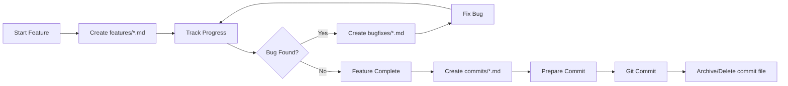

# Developer Notes

Thư mục này chứa các ghi chú development, status implementation, bug fixes và commit summaries trong quá trình phát triển dự án.

## 📁 Cấu trúc thư mục

```
docs/dev-notes/
├── features/           # Feature implementation status và progress notes
│   └── gold-implementation-status.md
├── bugfixes/          # Bug fix documentation và root cause analysis
│   └── fix-uuid-validation-error.md
├── commits/           # Commit summaries và change logs chi tiết
│   └── fashion-tool-commit.md
└── README.md          # File này
```

## 🎯 Mục đích

### 1. Features (`features/`)
Chứa các file tracking implementation progress của features mới:
- Status: ✅ Done, 🚧 In Progress, ⏳ Pending
- Checklist các tasks cần làm
- Technical decisions và reasoning
- Next steps và todos

**Format:** `{feature-name}-implementation-status.md`

**Ví dụ:**
- `gold-implementation-status.md` - Gold Price Viewer feature
- `weather-implementation-status.md` - Weather Tool (future)

### 2. Bug Fixes (`bugfixes/`)
Chứa documentation chi tiết về bug fixes:
- Problem description
- Root cause analysis
- Solution implementation
- Testing results
- Prevention measures

**Format:** `fix-{bug-description}.md`

**Ví dụ:**
- `fix-uuid-validation-error.md` - UUID validation in Fashion Tool
- `fix-cors-policy.md` - CORS configuration issue

### 3. Commits (`commits/`)
Chứa commit summaries chi tiết trước khi commit:
- Changes overview
- Files modified
- Testing checklist
- Breaking changes (if any)
- Commit message draft

**Format:** `{feature-or-component}-commit.md`

**Ví dụ:**
- `fashion-tool-commit.md` - Fashion Tool feature commit
- `gold-api-commit.md` - Gold API implementation commit

## 📝 Quy tắc sử dụng

### Khi implement feature mới:
1. Tạo file `features/{feature-name}-implementation-status.md`
2. Track progress với checklist
3. Document technical decisions
4. Update status khi có tiến triển

### Khi fix bug:
1. Tạo file `bugfixes/fix-{bug-description}.md`
2. Document root cause analysis
3. Explain solution với code examples
4. Add verification steps

### Khi chuẩn bị commit:
1. Tạo file `commits/{feature-name}-commit.md`
2. List tất cả changes
3. Verify testing checklist
4. Draft commit message
5. Sau khi commit, có thể archive hoặc xóa file

## 🔄 Workflow



## 🗂️ Archive Policy

### Keep Forever:
- `features/*.md` - Historical reference for implementation decisions
- `bugfixes/*.md` - Knowledge base for similar issues

### Can Archive/Delete:
- `commits/*.md` - After successful commit, information is in git history

## 📊 Current Status

### Features
- ✅ Gold Price Viewer (`gold-implementation-status.md`)
  - Status: 70% complete (backend done, frontend partial)

### Bug Fixes
- ✅ UUID Validation Error (`fix-uuid-validation-error.md`)
  - Status: Fixed and documented

### Commits
- ✅ Fashion Tool (`fashion-tool-commit.md`)
  - Status: Ready to commit

## 🔗 Related Documentation

- Main docs: `docs/`
  - `API_DOCUMENTATION.md` - API reference
  - `DATABASE_SCHEMA.md` - Database structure
  - `TROUBLESHOOTING.md` - Common issues
  - `CHANGELOG.md` - Version history

- Development guides: `docs/`
  - `SETUP_INSTALLATION.md` - Setup guide
  - `FRONTEND_GUIDE.md` - Frontend development
  - `DEPLOYMENT_GUIDE.md` - Deployment instructions

## 💡 Best Practices

1. **Be Specific**: Use descriptive filenames
   - ❌ `status.md`
   - ✅ `gold-implementation-status.md`

2. **Keep Updated**: Update status files as you progress
   - Mark tasks as done: ✅
   - Note blockers: 🚫
   - Add timestamps for major updates

3. **Document Decisions**: Explain why, not just what
   ```markdown
   # Why we chose PostgreSQL over MongoDB
   - Need for ACID transactions
   - Complex relationships between entities
   - Team familiarity with SQL
   ```

4. **Cross-reference**: Link related docs
   ```markdown
   See also:
   - [API Documentation](../API_DOCUMENTATION.md)
   - [Database Schema](../DATABASE_SCHEMA.md#gold_rates)
   ```

5. **Use Templates**: Create templates for consistency
   - Feature status template
   - Bug fix template
   - Commit summary template

## 🚀 Quick Actions

### Create new feature status:
```bash
cd docs/dev-notes/features
# Copy template or create new file
code {feature-name}-implementation-status.md
```

### Create bug fix doc:
```bash
cd docs/dev-notes/bugfixes
code fix-{bug-description}.md
```

### Create commit summary:
```bash
cd docs/dev-notes/commits
code {feature-name}-commit.md
```

---

**Maintained by:** KaDong Team  
**Last Updated:** 2025-11-11  
**Version:** 1.0.0
