# 🛠️ Developer Notes

**Purpose:** Development tracking, working documents, and knowledge base

---

## 📁 Folder Structure

```
docs/dev-notes/
├── implementations/    # NEW feature implementation tracking
├── enhancements/      # EXISTING feature improvements
├── bugfixes/         # Bug fix documentation with root cause
├── planning/         # Planning and analysis documents
└── README.md         # This file
```

---

## 🎯 Document Categories

### 1. Implementations (`implementations/`)
Track NEW features being built from scratch

**Naming:** `{feature-name}-status.md`

**Examples:**
- ✅ `gold-prices-status.md` - Gold price tracking feature
- ✅ `weather-tool-status.md` - Weather tool (planned)
- ✅ `user-authentication-status.md` - Auth system

**When to use:**
- Feature doesn't exist yet
- Building from scratch
- Need to track progress through phases

### 2. Enhancements (`enhancements/`)
Document improvements to EXISTING features

**Naming:** `{feature-name}-{enhancement-type}.md`

**Examples:**
- ✅ `wishlist-category-enhancement.md` - Add category combobox to wishlist
- ✅ `currency-api-resilience.md` - Add 5 API fallbacks
- ✅ `gold-real-api-integration.md` - Replace mock with real API

**When to use:**
- Feature already exists
- Making UX/performance improvements
- Changing implementation (mock → real API)

### 3. Bug Fixes (`bugfixes/`)
Root cause analysis and solutions

**Naming:** `fix-{bug-description}.md`

**Examples:**
- ✅ `fix-uuid-validation.md` - Invalid UUID format
- ✅ `fix-shopee-url-extraction.md` - New URL format not recognized
- ✅ `fix-category-hardcode.md` - Hardcoded category field

**When to use:**
- Fixing bugs (not new features)
- Need to document root cause
- Learning lesson for future

### 4. Planning (`planning/`)
Planning and analysis before implementation

**Naming:** `{topic}-plan.md`

**Examples:**
- ✅ `docs-restructure-plan.md` - Reorganize docs folder
- ✅ `database-migration-plan.md` - DB schema changes
- ✅ `api-versioning-plan.md` - API v2 rollout

**When to use:**
- Planning major changes
- Need to analyze options
- Documenting proposals for review

---

## 📝 Usage Guidelines

### Creating New Docs

**For NEW features:**
```bash
cd docs/dev-notes/implementations
code {feature-name}-status.md
```

**For IMPROVEMENTS to existing:**
```bash
cd docs/dev-notes/enhancements
code {feature-name}-{type}.md
```

**For BUG FIXES:**
```bash
cd docs/dev-notes/bugfixes
code fix-{bug-description}.md
```

**For PLANNING:**
```bash
cd docs/dev-notes/planning
code {topic}-plan.md
```

---

## 🔄 Workflow

```mermaid
graph LR
    A[Start Task] --> B{Type?}
    B -->|NEW Feature| C[implementations/*.md]
    B -->|Improvement| D[enhancements/*.md]
    B -->|Bug| E[bugfixes/*.md]
    B -->|Planning| F[planning/*.md]
    C --> G[Track Progress]
    D --> G
    E --> G
    F --> G
    G --> H{Complete?}
    H -->|Yes| I[Update Status ✅]
    H -->|No| G
    I --> J[Archive as Knowledge Base]
```



---

## 🗂️ Archive Policy

**Keep Forever:**
- ✅ `implementations/*` - Implementation decisions and patterns
- ✅ `enhancements/*` - Enhancement history and reasoning
- ✅ `bugfixes/*` - Bug knowledge base
- ✅ `planning/*` - Planning decisions and analysis

**Reasoning:** All dev-notes are valuable knowledge base for future reference

---

## � Key Differences

### Implementations vs Enhancements

| Aspect | Implementations | Enhancements |
|--------|----------------|--------------|
| **Feature** | NEW (doesn't exist) | EXISTING (already has) |
| **Scope** | Build from scratch | Improve what exists |
| **Example** | gold-prices-status.md | wishlist-category-enhancement.md |
| | weather-tool-status.md | currency-api-resilience.md |

**Rule:** If feature doesn't exist → `implementations/`, if improving existing → `enhancements/`

---

## 📊 Current Status

### Implementations
- ✅ Gold Prices (`gold-prices-status.md`) - 100% complete

### Enhancements
- ✅ Wishlist Category (`wishlist-category-enhancement.md`) - 95% complete
- ✅ Currency API Resilience (`currency-api-resilience.md`) - 100% complete
- ✅ Gold Real API Integration (`gold-real-api-integration.md`) - 100% complete

### Bug Fixes
- ✅ UUID Validation (`fix-uuid-validation.md`) - Fixed
- ✅ Shopee URL Extraction (`fix-shopee-url-extraction.md`) - Fixed

### Planning
- ✅ Docs Restructure (`docs-restructure-plan.md`) - Executed
- ✅ Backend Restructure (`backend-restructure-plan.md`) - Completed

---

## 🔗 Related Documentation

### Main Documentation
- [API Documentation](../02-architecture/API_DOCUMENTATION.md)
- [Database Schema](../02-architecture/DATABASE_SCHEMA.md)
- [Project Structure](../02-architecture/PROJECT_STRUCTURE.md)

### Guides
- [Setup Installation](../01-getting-started/SETUP_INSTALLATION.md)
- [Frontend Guide](../03-development/FRONTEND_GUIDE.md)
- [Contributing](../03-development/CONTRIBUTING.md)

### Reference
- [Documentation Naming Guide](../DOCUMENTATION_NAMING_GUIDE.md)
- [Changelog](../06-migration/CHANGELOG.md)

---

## 📋 Templates

Use these templates in `docs/dev-notes/`:
- `TEMPLATE_feature_status.md` - For implementations
- `TEMPLATE_bugfix.md` - For bugfixes
- *(Create enhancement template as needed)*

---

**Maintained by:** KaDong Team  
**Last Updated:** 2025-11-13  
**Version:** 2.0.0 (Restructured)

