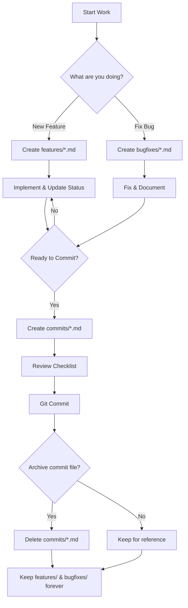

# 📊 Documentation Structure Visualization

## Before Reorganization ❌

```
KaDongSite/
├── COMMIT_SUMMARY.md              ← 🔴 Cluttered root
├── GOLD_IMPLEMENTATION_STATUS.md  ← 🔴 Cluttered root
├── docs/
│   ├── FIX_UUID_VALIDATION_ERROR.md  ← 🔴 Mixed with permanent docs
│   ├── API_DOCUMENTATION.md
│   ├── DATABASE_SCHEMA.md
│   └── ... (other permanent docs)
├── backend/
├── src/
└── ...
```

**Problems:**
- ❌ Root folder cluttered with temporary files
- ❌ No clear distinction between permanent and working docs
- ❌ Hard to find implementation status
- ❌ No templates or guidelines
- ❌ Inconsistent naming

---

## After Reorganization ✅

```
KaDongSite/
├── docs/
│   ├── dev-notes/                           ← ✨ NEW organized structure
│   │   ├── features/                        ← Feature tracking
│   │   │   └── gold-implementation-status.md
│   │   ├── bugfixes/                        ← Bug documentation
│   │   │   └── fix-uuid-validation-error.md
│   │   ├── commits/                         ← Commit preparation
│   │   │   └── fashion-tool-commit.md
│   │   ├── README.md                        ← 📖 Complete guide
│   │   ├── QUICK_REFERENCE.md               ← ⚡ Quick commands
│   │   ├── REORGANIZATION_SUMMARY.md        ← 📋 This change log
│   │   ├── TEMPLATE_feature_status.md       ← 📝 Copy for new features
│   │   ├── TEMPLATE_bugfix.md               ← 📝 Copy for bug fixes
│   │   ├── TEMPLATE_commit.md               ← 📝 Copy for commits
│   │   └── .gitignore                       ← 🔒 Git rules
│   │
│   ├── API_DOCUMENTATION.md                 ← Permanent docs (unchanged)
│   ├── DATABASE_SCHEMA.md
│   ├── FRONTEND_GUIDE.md
│   ├── CHANGELOG.md
│   └── ... (other permanent docs)
│
├── backend/
├── src/
├── project_manifest.json                    ← ✅ Updated with devNotes section
└── ...
```

**Benefits:**
- ✅ Clean root folder
- ✅ Clear categorization (features/bugfixes/commits)
- ✅ Templates for consistency
- ✅ Comprehensive guides
- ✅ AI workflow integrated in manifest

---

## File Type Categories

### 🏗️ Permanent Documentation (docs/)
**Purpose:** Long-term reference, rarely changes  
**Location:** `docs/`  
**Examples:**
- API_DOCUMENTATION.md
- DATABASE_SCHEMA.md
- FRONTEND_GUIDE.md
- DEPLOYMENT_GUIDE.md

**Characteristics:**
- ✅ Keep forever
- ✅ Versioned in git
- ✅ Updated on major changes
- ✅ Public-facing

---

### 🛠️ Development Notes (docs/dev-notes/)
**Purpose:** Working documents, frequently updated  
**Location:** `docs/dev-notes/`

#### 📊 Features (features/)
**Tracks implementation progress**

```
features/
└── {feature-name}-implementation-status.md
    ├── Progress: XX%
    ├── Checklist: ✅/🚧/⏳
    ├── Technical decisions
    └── Next steps
```

**Lifecycle:**
1. Create at feature start
2. Update during implementation
3. Mark complete when done
4. Keep forever (knowledge base)

---

#### 🐛 Bug Fixes (bugfixes/)
**Documents root cause and solution**

```
bugfixes/
└── fix-{bug-description}.md
    ├── Problem description
    ├── Root cause analysis
    ├── Solution implementation
    ├── Prevention measures
    └── Lessons learned
```

**Lifecycle:**
1. Create when bug found
2. Document investigation
3. Document fix
4. Keep forever (prevent recurrence)

---

#### 📝 Commits (commits/)
**Prepares detailed commit info**

```
commits/
└── {feature-name}-commit.md
    ├── Changes overview
    ├── Testing checklist
    ├── Files modified
    ├── Commit message draft
    └── Breaking changes (if any)
```

**Lifecycle:**
1. Create before committing
2. Fill checklist
3. Draft commit message
4. After commit: Can archive/delete (info in git)

---

## Workflow Visualization



---

## Naming Convention Matrix

| Document Type | Format | Example | Keep Forever? |
|---------------|--------|---------|---------------|
| Feature Status | `{feature-name}-implementation-status.md` | `gold-implementation-status.md` | ✅ Yes |
| Bug Fix | `fix-{bug-description}.md` | `fix-uuid-validation-error.md` | ✅ Yes |
| Commit Summary | `{feature-name}-commit.md` | `fashion-tool-commit.md` | ⚠️ Optional |
| WIP Notes | `{anything}-wip.md` | `feature-wip.md` | ❌ No (git ignored) |
| Temp Notes | `{anything}.tmp.md` | `notes.tmp.md` | ❌ No (git ignored) |

---

## AI Assistant Integration

### project_manifest.json Section

```json
{
  "conventions": {
    "documentation": {
      "devNotes": {
        "location": "docs/dev-notes/",
        "aiInstructions": [
          "When implementing new feature: Create features/*.md",
          "When fixing bug: Create bugfixes/fix-*.md", 
          "Before committing: Create commits/*.md",
          "Never create status files in project root",
          "Use templates for consistency"
        ]
      }
    }
  }
}
```

**AI will now:**
1. ✅ Create status files in correct location
2. ✅ Use proper naming conventions
3. ✅ Follow templates
4. ✅ Update existing files instead of duplicates
5. ✅ Keep root folder clean

---

## Quick Stats

### Files Created
- 📁 4 directories (dev-notes, features, bugfixes, commits)
- 📄 8 markdown files (README, 3 templates, 3 guides, reorganization summary)
- 🔒 1 .gitignore file

### Files Moved
- ✅ 3 files moved from root/docs to dev-notes structure

### Lines of Documentation
- 📝 ~700+ lines of guides and templates
- 📊 Comprehensive structure for future development

### project_manifest.json
- 📌 Version bumped: 1.1.0 → 1.2.0
- ➕ Added devNotes section with AI instructions
- 📋 Added metadata.changes.v1.2.0

---

## Access Patterns

### Daily Use
```bash
# Check feature progress
cat docs/dev-notes/features/gold-implementation-status.md

# Document bug
vim docs/dev-notes/bugfixes/fix-new-bug.md

# Prepare commit
code docs/dev-notes/commits/my-changes-commit.md
```

### Quick Reference
```bash
# See all commands
cat docs/dev-notes/QUICK_REFERENCE.md

# Copy template
cp docs/dev-notes/TEMPLATE_feature_status.md docs/dev-notes/features/new-feature.md
```

---

## Success Metrics

| Metric | Before | After | Improvement |
|--------|--------|-------|-------------|
| Root folder files | 15+ | 12 | ✅ -3 clutter files |
| Status file location | Root | Organized | ✅ Clear structure |
| Templates available | 0 | 3 | ✅ +3 templates |
| Documentation | Scattered | Centralized | ✅ Easy to find |
| AI integration | Manual | Automatic | ✅ Manifest rules |

---

**Last Updated:** 2025-11-11  
**Status:** ✅ Complete  
**Impact:** High - Improved organization and workflow
