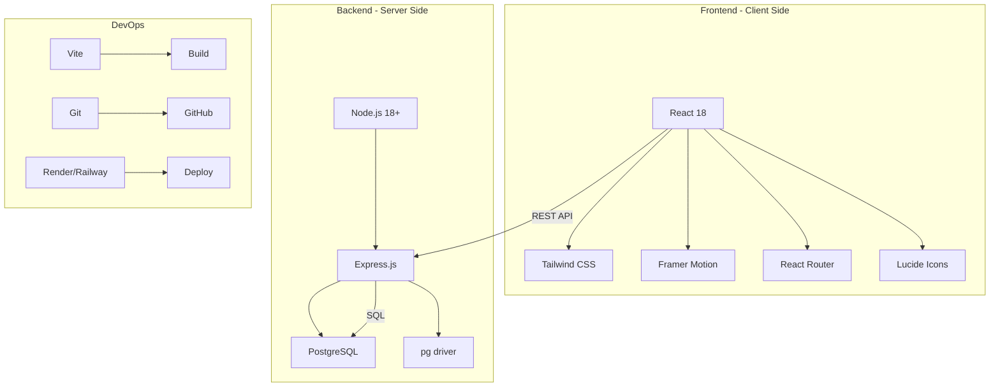
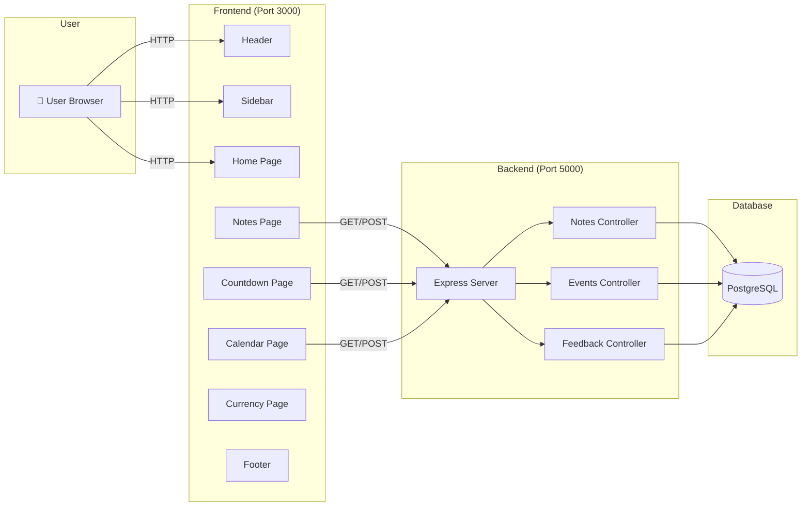

# 📖 01. Introduction - Giới thiệu dự án

## 1.1 Mục tiêu dự án

### Vấn đề cần giải quyết
Trong cuộc sống hàng ngày, chúng ta thường cần sử dụng nhiều công cụ tiện ích khác nhau:
- ✍️ Ghi chú nhanh những ý tưởng, việc cần làm
- 📅 Theo dõi các ngày kỷ niệm quan trọng
- 🗓️ Quản lý lịch trình cá nhân
- 💱 Chuyển đổi tiền tệ khi mua sắm online
- 📝 Lưu trữ thông tin cá nhân một cách an toàn

Thay vì phải sử dụng nhiều ứng dụng khác nhau, **Personal Utilities Website** ra đời để tập trung tất cả các công cụ này vào một nơi duy nhất.

### Giá trị mang lại
- 🎯 **Tập trung**: Tất cả công cụ ở một nơi, không cần chuyển đổi giữa nhiều app
- 🔒 **Riêng tư**: Dữ liệu được lưu trữ trên server riêng, không chia sẻ với bên thứ ba
- 💝 **Cá nhân hóa**: Thiết kế và tính năng phù hợp với nhu cầu của gia đình
- 🚀 **Mở rộng dễ dàng**: Có thể thêm công cụ mới bất cứ lúc nào

---

## 1.2 Ý tưởng tổng thể

### Khái niệm
**Personal Utilities Website** là một nền tảng web tổng hợp các công cụ tiện ích nhỏ (mini-tools) được thiết kế dành riêng cho việc sử dụng cá nhân và gia đình.

### Đặc điểm chính
```
┌─────────────────────────────────────────┐
│   🌸 Personal Utilities Website 🌸     │
├─────────────────────────────────────────┤
│                                         │
│  📝 Notes      ⏰ Countdown            │
│  📅 Calendar   💱 Currency             │
│  💬 Feedback   ... More tools          │
│                                         │
│  ✨ Dễ thương • Hiện đại • Dễ dùng    │
└─────────────────────────────────────────┘
```

### Định hướng phát triển
- **Phase 1** (Hiện tại): 4 công cụ cơ bản (Notes, Countdown, Calendar, Currency)
- **Phase 2**: Thêm Weather, Todo List, Timer/Pomodoro
- **Phase 3**: Thêm tính năng chia sẻ, collaboration
- **Phase 4**: Mobile app (React Native/Flutter)

### Kiến trúc Module
Mỗi công cụ là một **module độc lập**:
```
Module = Page + API + Database Table + UI Components
```

Việc thêm module mới **không ảnh hưởng** đến các module hiện có.

---

## 1.3 Đối tượng người dùng

### Người dùng chính
- 👥 **2 người**: Vợ và chồng
- 🎯 **Use case chính**:
  - Vợ: Ghi chú công việc, lịch trình, đếm ngày kỷ niệm
  - Chồng: Chuyển đổi tiền tệ, quản lý sự kiện, ghi chú kỹ thuật

### Đặc điểm người dùng
| Tiêu chí | Mô tả |
|----------|-------|
| **Độ tuổi** | 25-35 tuổi |
| **Tech-savvy** | Trung bình - cao, quen với smartphone và web |
| **Nhu cầu** | Tiện ích nhanh, giao diện đẹp, dễ sử dụng |
| **Thời gian sử dụng** | Hàng ngày, 5-10 phút mỗi lần |
| **Thiết bị** | Desktop (70%), Mobile (30%) |

### Nhu cầu cụ thể
- ✅ Truy cập nhanh từ bất kỳ đâu
- ✅ Giao diện dễ thương, không gây mỏi mắt
- ✅ Responsive tốt trên điện thoại
- ✅ Không cần đăng nhập phức tạp (simple auth)
- ✅ Dữ liệu được đồng bộ giữa các thiết bị

---

## 1.4 Tính năng chính

### 📝 1. Notes (Ghi chú)
**Mô tả**: Ghi chú nhanh với màu sắc tùy chỉnh

**Tính năng**:
- ✍️ Tạo/Sửa/Xóa ghi chú
- 🎨 6 màu pastel để phân loại
- 📌 Ghim ghi chú quan trọng
- 🔍 Tìm kiếm ghi chú theo nội dung
- 🗑️ Soft delete (có thể khôi phục)

**User stories**:
```
- Là một người dùng, tôi muốn tạo ghi chú nhanh để không quên việc cần làm
- Là một người dùng, tôi muốn phân loại ghi chú theo màu sắc để dễ quản lý
```

---

### ⏰ 2. Countdown Events (Đếm ngày kỷ niệm)
**Mô tả**: Theo dõi và đếm ngày đến các sự kiện quan trọng

**Tính năng**:
- 📅 Tạo sự kiện với ngày tháng
- 🔄 Lặp lại hàng năm (sinh nhật, kỷ niệm)
- 🎨 Màu sắc tùy chỉnh
- ⏳ Hiển thị số ngày đã trải qua/còn lại
- 🔔 Nhắc nhở (future feature)

**Use cases**:
- Ngày yêu nhau: 1/1/2020 → Đã 1,776 ngày
- Sinh nhật: 15/3 → Còn 124 ngày
- Kỷ niệm cầu hôn: 14/5/2023

---

### 📅 3. Calendar (Lịch cá nhân)
**Mô tả**: Xem lịch trình và sự kiện tháng

**Tính năng**:
- 🗓️ Hiển thị lịch theo tháng
- ➕ Thêm sự kiện vào ngày cụ thể
- 🎨 Màu sắc phân biệt loại sự kiện
- 🔍 Xem sự kiện sắp tới
- ⬅️➡️ Chuyển tháng dễ dàng

**Layout**:
```
┌─────────────────────────────────────┐
│  ← Tháng 11, 2024 →                │
├─────────────────────────────────────┤
│ CN  T2  T3  T4  T5  T6  T7        │
│                  1   2   3         │
│  4   5   6   7   8   9  10        │
│ 11• 12  13  14  15• 16  17        │
│ 18  19  20  21  22  23  24        │
│ 25  26  27  28  29  30            │
└─────────────────────────────────────┘
• = Có sự kiện
```

---

### 💱 4. Currency Converter (Chuyển đổi tiền tệ)
**Mô tả**: Chuyển đổi giữa 8 loại tiền tệ phổ biến

**Tính năng**:
- 💵 8 loại tiền: USD, VND, EUR, GBP, JPY, KRW, CNY, THB
- 🔄 Chuyển đổi hai chiều
- 📊 Hiển thị tỷ giá
- ⚡ Số tiền nhanh (100, 500, 1000, 5000, 10000)
- 🔄 Cập nhật tỷ giá tự động (daily)

**Example**:
```
From: USD 🇺🇸  |  100.00
      ⇅ Swap
To:   VND 🇻🇳  |  2,400,000.00

Rate: 1 USD = 24,000 VND
```

---

### 💬 5. Feedback (Góp ý)
**Mô tả**: Gửi phản hồi và đề xuất tính năng mới

**Tính năng**:
- 📝 Gửi feedback (bug, feature request, improvement)
- ⭐ Đánh giá 1-5 sao
- 🔒 Anonymous hoặc có tên
- 📊 Admin xem và quản lý feedback
- ✅ Cập nhật trạng thái (pending, reviewed, resolved)

---

## 1.5 Kiến trúc hệ thống tổng quan

### Tech Stack



### Kiến trúc 3 tầng (3-Tier Architecture)

```
┌─────────────────────────────────────────────┐
│         PRESENTATION LAYER                  │
│  (React + Tailwind + Framer Motion)         │
│  • User Interface                           │
│  • Client-side routing                      │
│  • State management                         │
└─────────────────┬───────────────────────────┘
                  │ REST API (JSON)
                  ▼
┌─────────────────────────────────────────────┐
│         APPLICATION LAYER                   │
│    (Node.js + Express.js)                   │
│  • RESTful API endpoints                    │
│  • Business logic                           │
│  • Authentication                           │
│  • Validation                               │
└─────────────────┬───────────────────────────┘
                  │ SQL Queries
                  ▼
┌─────────────────────────────────────────────┐
│            DATA LAYER                       │
│         (PostgreSQL)                        │
│  • Database tables                          │
│  • Relationships                            │
│  • Indexes & constraints                    │
└─────────────────────────────────────────────┘
```

### Component Diagram



### Data Flow

```
User Action → React Component → API Call → Express Route 
→ Controller → Database Query → Response → Update UI
```

**Example**: Tạo ghi chú mới
```
1. User clicks "Add Note" button
2. React form submits data
3. POST /api/notes with JSON body
4. Express route receives request
5. Controller validates data
6. INSERT INTO notes table
7. Return new note with ID
8. React updates state & UI
```

---

## 1.6 Triết lý thiết kế

### Core Principles

#### 🎯 **A** - Accessible (Dễ tiếp cận)
- **Contrast ratios** phù hợp cho người khiếm thị
- **Keyboard navigation** hoàn chỉnh
- **ARIA labels** cho screen readers
- **Focus states** rõ ràng
- **Error messages** dễ hiểu

#### 📈 **S** - Scalable (Dễ mở rộng)
- **Modular architecture**: Mỗi tool là module độc lập
- **Component-based**: Tái sử dụng components
- **RESTful API**: Dễ thêm endpoints mới
- **Database schema**: Designed for growth
- **No hardcoded values**: Sử dụng config

#### 💎 **M** - Modern (Hiện đại)
- **Latest React features**: Hooks, Suspense
- **Modern CSS**: Tailwind, Flexbox, Grid
- **ES6+ syntax**: Arrow functions, async/await
- **Progressive enhancement**: Works without JS
- **Performance optimized**: Code splitting, lazy loading

#### 🎨 **C** - Cute Tech Design (Thiết kế dễ thương)
- **Pastel colors**: Hồng, tím, xanh mint, kem
- **Rounded corners**: 16px+ border radius
- **Soft shadows**: Subtle drop shadows
- **Smooth animations**: Framer Motion
- **Friendly icons**: Lucide React
- **Playful typography**: Nunito, Poppins

### Design Tokens

```javascript
// Color Palette
const colors = {
  pastel: {
    pink: '#FFD6E8',      // Ghi chú, yêu thương
    purple: '#E6D5F7',    // Đếm ngày, kỷ niệm
    mint: '#C8F4E3',      // Lịch, sự kiện
    blue: '#D4E9FF',      // Thông tin
    peach: '#FFE5CC',     // Cảnh báo nhẹ
    cream: '#FFF8E7',     // Background
  }
}

// Typography
const fonts = {
  heading: 'Poppins',    // Bold, modern
  body: 'Nunito',        // Friendly, readable
}

// Spacing
const spacing = {
  xs: '0.25rem',  // 4px
  sm: '0.5rem',   // 8px
  md: '1rem',     // 16px
  lg: '1.5rem',   // 24px
  xl: '2rem',     // 32px
}
```

### UI/UX Principles

#### 1. **Consistency** (Nhất quán)
- Same button styles across all pages
- Same color meanings everywhere
- Same spacing rhythm

#### 2. **Feedback** (Phản hồi)
- Loading states for async actions
- Success/error messages
- Hover effects on clickable items
- Disabled states

#### 3. **Forgiveness** (Tha thứ)
- Soft delete (có thể undo)
- Confirmation dialogs for destructive actions
- Auto-save drafts

#### 4. **Simplicity** (Đơn giản)
- Max 3 clicks to any feature
- Clean, uncluttered interface
- Progressive disclosure (show advanced features when needed)

---

## 📎 Related Links

- **[Project Structure](02_ProjectStructure.md)** - Cấu trúc thư mục và code
- **[Setup Guide](03_SetupAndInstallation.md)** - Hướng dẫn cài đặt
- **[Database Schema](04_DatabaseSchema.md)** - Thiết kế database
- **[API Documentation](05_API_Documentation.md)** - API endpoints
- **[Frontend Overview](06_FrontendOverview.md)** - Giao diện chi tiết

---

**Version**: 1.0  
**Last Updated**: November 11, 2024  
**Author**: KaDong Team  
**Status**: ✅ Active Development
