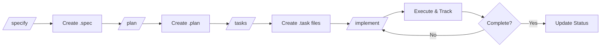

# Spec Kit - Specification Management System

**Version:** 1.0.0  
**Last Updated:** 2025-11-11

---

## 📋 Overview

**Spec Kit** is a structured workflow system for managing feature specifications, implementation plans, and task breakdowns. It provides a consistent framework for planning, implementing, and tracking development work.

### What is Spec Kit?

Spec Kit helps you:
- **Define** what needs to be built (Specifications)
- **Plan** how to build it (Implementation Plans)
- **Break down** work into actionable tasks (Task Breakdown)
- **Track** progress systematically
- **Document** decisions and learnings

---

## 📁 Directory Structure

```
specs/
├── README.md                    ← This file
├── config.json                  ← Configuration settings
├── templates/                   ← Reusable templates
│   ├── TEMPLATE_spec.md        ← Specification template
│   ├── TEMPLATE_plan.md        ← Implementation plan template
│   └── TEMPLATE_task.md        ← Task breakdown template
├── plans/                       ← Implementation plans
│   ├── 01_init.plan            ← Project initialization plan
│   └── {spec_id}.plan          ← Plan for each spec
├── 01_init.spec                ← Project initialization spec
├── 02_feature.spec             ← Feature specifications
└── ...                          ← More specs
```

---

## 🔄 Workflow

### The Spec Kit Process



### 4 Commands

1. **`/specify`** - Create a new specification
2. **`/plan`** - Create an implementation plan for a spec
3. **`/tasks`** - Break down a plan into tasks
4. **`/implement`** - Execute and track implementation

---

## 🚀 Quick Start

### 1. Create a Specification (`/specify`)

**When to use:** You have a new feature or change to define

**Command:**
```
/specify {feature_name}
```

**What it does:**
- Creates `specs/{id}_{feature}.spec` using template
- Prompts you to fill in:
  - Overview & goals
  - Acceptance criteria
  - Technical design
  - Security considerations
  - Success metrics

**Example:**
```
/specify user_authentication
```

Creates: `specs/06_user_authentication.spec`

---

### 2. Create an Implementation Plan (`/plan`)

**When to use:** You have a completed spec and need to plan implementation

**Command:**
```
/plan {spec_id}
```

**What it does:**
- Creates `specs/plans/{spec_id}.plan` using template
- Links to the spec
- Breaks work into phases
- Sets timeline and milestones

**Example:**
```
/plan 06_user_authentication
```

Creates: `specs/plans/06_user_authentication.plan`

---

### 3. Break Down Tasks (`/tasks`)

**When to use:** You need granular task breakdown for a phase

**Command:**
```
/tasks {plan_id} {phase_number}
```

**What it does:**
- Creates `specs/plans/tasks/{plan_id}_phase{X}_task{Y}.task`
- Lists all subtasks
- Defines acceptance criteria
- Includes implementation details

**Example:**
```
/tasks 06_user_authentication 3
```

Creates: `specs/plans/tasks/06_user_authentication_phase3_task1.task`

---

### 4. Implement & Track (`/implement`)

**When to use:** Ready to start coding

**Command:**
```
/implement {task_id}
```

**What it does:**
- Marks task as "In Progress"
- Creates feature status file in `docs/dev-notes/features/`
- Tracks progress with checkboxes
- Updates plan progress

**Example:**
```
/implement 06_user_authentication_phase3_task1
```

Creates: `docs/dev-notes/features/user-authentication-implementation-status.md`

---

## 📝 Document Types

### 1. Specification (`.spec`)

**Purpose:** Define WHAT to build

**Key Sections:**
- Overview & Goals
- Acceptance Criteria (Must/Should/Nice to Have)
- Technical Design (Architecture, API, Database)
- Security Considerations
- Performance Requirements
- Testing Strategy
- Timeline & Dependencies

**Template:** `specs/templates/TEMPLATE_spec.md`

**Example:** `specs/05_gold_prices.spec`

---

### 2. Implementation Plan (`.plan`)

**Purpose:** Define HOW to build it

**Key Sections:**
- Timeline & Milestones
- Phases (Setup, Database, Backend, Frontend, Testing, Docs, Deployment)
- Tasks with checkboxes
- Progress tracking
- Issues & Risks
- Technical Decisions

**Template:** `specs/templates/TEMPLATE_plan.md`

**Example:** `specs/plans/05_gold_prices.plan`

---

### 3. Task Breakdown (`.task`)

**Purpose:** Granular implementation steps

**Key Sections:**
- Subtasks with checkboxes
- Files to create/modify
- Implementation code snippets
- Testing plan
- Dependencies
- Success criteria

**Template:** `specs/templates/TEMPLATE_task.md`

**Example:** `specs/plans/tasks/05_gold_prices_phase3_task1.task`

---

## 🎯 Best Practices

### Writing Specifications

✅ **Do:**
- Define clear, measurable acceptance criteria
- Include technical diagrams and examples
- Consider security and performance upfront
- Link to related specs and documentation
- Keep it focused on WHAT, not HOW

❌ **Don't:**
- Mix implementation details into specs
- Skip acceptance criteria
- Ignore edge cases and error handling
- Forget to define success metrics

### Creating Plans

✅ **Do:**
- Break work into logical phases
- Set realistic timelines
- Track progress with percentages
- Document technical decisions
- Include rollback plans

❌ **Don't:**
- Create overly detailed plans upfront
- Skip risk assessment
- Ignore dependencies
- Forget to update progress

### Managing Tasks

✅ **Do:**
- Keep tasks small (< 1 day)
- Include code examples
- Define clear acceptance criteria
- Link to parent plan and spec
- Update status regularly

❌ **Don't:**
- Create tasks without context
- Skip testing checklist
- Ignore dependencies
- Forget to document learnings

---

## 📊 Status Tracking

### Spec Status
- 📝 **Draft** - Initial creation, needs review
- 🚧 **In Progress** - Under active development
- ✅ **Completed** - Fully implemented and deployed
- ❌ **Cancelled** - No longer needed

### Plan Status
- 📝 **Planning** - Creating the plan
- 🚧 **In Progress** - Active implementation
- ✅ **Completed** - All phases done
- ❌ **Cancelled** - Project cancelled

### Task Status
- 📝 **Todo** - Not started
- 🚧 **In Progress** - Actively working
- ✅ **Done** - Completed and verified
- ❌ **Blocked** - Cannot proceed

---

## 🔗 Integration with Project

### Links to Existing Systems

**Dev Notes:**
- Feature Status: `docs/dev-notes/features/{feature}-implementation-status.md`
- Bug Fixes: `docs/dev-notes/bugfixes/fix-{bug}.md`
- Commits: `docs/dev-notes/commits/{feature}-commit.md`

**Documentation:**
- API Docs: `docs/API_DOCUMENTATION.md`
- Database Schema: `docs/DATABASE_SCHEMA.md`
- User Guides: `docs/USER_GUIDE.md`

**Project Files:**
- Manifest: `project_manifest.json`
- README: `README.md`
- CHANGELOG: `CHANGELOG.md`

---

## 🛠️ Configuration

Configuration is stored in `specs/config.json`:

```json
{
  "version": "1.0.0",
  "templatePaths": {
    "spec": "specs/templates/TEMPLATE_spec.md",
    "plan": "specs/templates/TEMPLATE_plan.md",
    "task": "specs/templates/TEMPLATE_task.md"
  },
  "namingConventions": {
    "specs": "{id}_{name}.spec",
    "plans": "{spec_id}.plan",
    "tasks": "{plan_id}_phase{X}_task{Y}.task"
  },
  "defaultSettings": {
    "testCoverageTarget": 80,
    "performanceTargetMs": 500,
    "reviewFrequency": "weekly"
  }
}
```

---

## 📚 Examples

### Example 1: Complete Workflow

**1. Create Spec:**
```
/specify payment_integration
```

**2. Fill in spec with:**
- Payment gateway options (Stripe, PayPal)
- API requirements
- Security requirements (PCI compliance)
- Error handling

**3. Create Plan:**
```
/plan 07_payment_integration
```

**4. Define phases:**
- Phase 1: Setup Stripe SDK
- Phase 2: Backend API
- Phase 3: Frontend checkout flow
- Phase 4: Testing
- Phase 5: Documentation

**5. Break down Phase 2:**
```
/tasks 07_payment_integration 2
```

**6. Implement:**
```
/implement 07_payment_integration_phase2_task1
```

---

### Example 2: Existing Feature Spec

For the **Gold Prices** feature:

**Spec:** `specs/05_gold_prices.spec`
- ✅ Database schema defined
- ✅ API endpoints documented
- ✅ Provider system designed
- ✅ Cron scheduler specified

**Plan:** `specs/plans/05_gold_prices.plan`
- ✅ Phase 1-4: Complete (85%)
- 🚧 Phase 5: Testing (30%)
- ⏳ Phase 6: Documentation
- ⏳ Phase 7: Deployment

**Status:** `docs/dev-notes/features/gold-implementation-status.md`
- Backend: 100%
- Frontend: 100% structure, charts need testing
- Overall: 70%

---

## ❓ FAQ

### Q: When should I create a spec?
**A:** For any new feature, major refactor, or significant change. Skip for small bug fixes.

### Q: How detailed should plans be?
**A:** Detailed enough to guide implementation but flexible enough to adapt. Aim for clarity over perfection.

### Q: Do I need task files for everything?
**A:** No. Use tasks for complex phases. Simple phases can be tracked in the plan directly.

### Q: How often should I update status?
**A:** Update specs when requirements change, plans weekly, and tasks daily when active.

### Q: Can I modify templates?
**A:** Yes! Templates are guidelines. Adapt them to your project's needs.

### Q: What if a spec changes mid-implementation?
**A:** Update the spec, bump version, document in Review History, and adjust plan accordingly.

---

## 🔄 Maintenance

### Weekly Tasks
- [ ] Review all in-progress specs
- [ ] Update plan progress percentages
- [ ] Check for blocked tasks
- [ ] Update milestone dates

### Monthly Tasks
- [ ] Archive completed specs
- [ ] Review and update templates
- [ ] Analyze velocity metrics
- [ ] Update best practices

---

## 🎓 Learning Resources

### Internal Docs
- `docs/dev-notes/README.md` - Dev notes workflow
- `docs/CONTRIBUTING.md` - Contribution guidelines
- `project_manifest.json` - Project structure

### External Resources
- [Specification by Example](https://example.com)
- [Agile Planning Best Practices](https://example.com)
- [Documentation as Code](https://example.com)

---

## 🤝 Contributing

### Adding New Templates
1. Create template in `specs/templates/`
2. Update `config.json` with template path
3. Document in this README
4. Add example usage

### Improving Workflow
1. Discuss with team
2. Test changes on a feature
3. Update templates and docs
4. Share learnings

---

## 📞 Support

**Questions?** Ask the team or check:
- Project README: `README.md`
- Dev Notes Guide: `docs/dev-notes/README.md`
- Project Manifest: `project_manifest.json`

---

**Happy Specifying! 🚀**

*Maintained by: Development Team*  
*Last Review: 2025-11-11*
