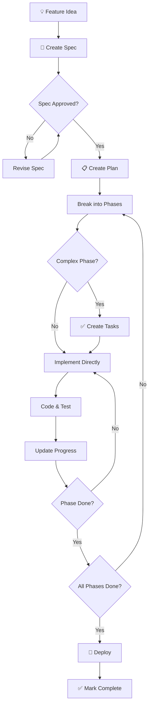

# 📚 Spec Kit - Hướng Dẫn Sử Dụng Chi Tiết

**Version:** 1.0.0  
**Last Updated:** 2025-11-13

---

## 📋 Mục Lục

1. [Giới Thiệu](#giới-thiệu)
2. [Cấu Trúc Folder](#cấu-trúc-folder)
3. [Quy Trình Làm Việc](#quy-trình-làm-việc)
4. [Hướng Dẫn Chi Tiết Từng Bước](#hướng-dẫn-chi-tiết-từng-bước)
5. [Naming Conventions](#naming-conventions)
6. [Best Practices](#best-practices)
7. [Ví Dụ Thực Tế](#ví-dụ-thực-tế)
8. [Troubleshooting](#troubleshooting)

---

## 🎯 Giới Thiệu

### Spec Kit là gì?

**Spec Kit** là hệ thống quản lý workflow development có cấu trúc, giúp team:
- **Định nghĩa rõ ràng** những gì cần build (Specifications)
- **Lập kế hoạch chi tiết** cách thức build (Implementation Plans)
- **Chia nhỏ công việc** thành các tasks có thể thực thi (Task Breakdown)
- **Theo dõi tiến độ** một cách hệ thống
- **Document quyết định** và bài học

### Tại sao cần Spec Kit?

**❌ Vấn đề khi KHÔNG có Spec Kit:**
- Features không rõ ràng → code sai yêu cầu
- Thiếu planning → timeline lệch, deadline trễ
- Tasks lớn quá → overwhelmed, không biết bắt đầu từ đâu
- Không track progress → không biết đã làm được gì
- Thiếu documentation → khó maintain sau này

**✅ Lợi ích khi CÓ Spec Kit:**
- Requirements rõ ràng → code đúng yêu cầu
- Plan chi tiết → estimate chính xác
- Tasks nhỏ gọn → dễ implement
- Progress tracking → biết tiến độ real-time
- Documentation đầy đủ → dễ maintain

---

## 📁 Cấu Trúc Folder

### Cấu Trúc Chuẩn

```
specs/                              # Root folder
│
├── 📄 INDEX.md                     # 🔍 Navigation & tổng quan
├── 🚀 QUICKSTART.md                # ⚡ Hướng dẫn nhanh
├── 📚 USAGE_GUIDE.md               # 📖 Bạn đang đọc file này
├── 📖 README.md                    # 📚 Tài liệu kỹ thuật đầy đủ
├── 🤖 COMMANDS.md                  # 🛠️ AI prompts reference
├── ⚙️ config.json                  # 🎛️ Configuration settings
│
├── 📝 specs/                       # Specifications (WHAT to build)
│   ├── 01_init.spec
│   ├── 02_weather_tool.spec
│   ├── 03_wishlist_management.spec
│   ├── 04_api_testing_framework.spec
│   ├── 05_currency_tool_api_resilience.spec
│   ├── 06_gold_prices_tool.spec
│   └── 07_wedding_invitation_url_encoder.spec
│
├── 📋 plans/                       # Implementation Plans (HOW to build)
│   ├── 01_init.plan
│   ├── 02_weather_tool.plan
│   ├── 03_wishlist_management.plan
│   ├── 04_api_testing_framework.plan
│   ├── 06_gold_prices_tool.plan
│   ├── 07_wedding_invitation_url_encoder.plan
│   │
│   └── ✅ tasks/                   # Task Breakdown (ACTION to do)
│       ├── 06_phase1e_task01_unit_tests.task
│       ├── 06_phase1e_task03_e2e_tests.task
│       ├── 06_phase2a_task01_automated_fetch.task
│       └── 06_phase2b_task01_alerts_schema.task
│
└── 📄 templates/                   # Templates
    ├── TEMPLATE_spec.md
    ├── TEMPLATE_plan.md
    └── TEMPLATE_task.md
```

### Giải Thích Chi Tiết

#### 📄 Root Files

| File | Mục đích | Đọc khi nào |
|------|----------|-------------|
| **INDEX.md** | Navigation hub, list tất cả specs/plans/tasks | Cần tìm file cụ thể |
| **QUICKSTART.md** | Hướng dẫn nhanh 10 phút | Lần đầu sử dụng |
| **USAGE_GUIDE.md** | Hướng dẫn chi tiết với examples | Muốn hiểu sâu |
| **README.md** | Tài liệu kỹ thuật đầy đủ | Cần reference chính thức |
| **COMMANDS.md** | AI prompts cho Copilot | Làm việc với AI |
| **config.json** | Settings và conventions | Customize behavior |

#### 📝 specs/ Folder

**Chứa gì:** Specification documents - định nghĩa WHAT cần build

**Khi nào tạo:**
- Feature mới
- Major refactor
- Breaking changes
- Significant enhancements

**Không cần tạo khi:**
- Bug fixes nhỏ
- UI tweaks
- Code cleanup

#### 📋 plans/ Folder

**Chứa gì:** Implementation plans - lập kế hoạch HOW để build

**Khi nào tạo:**
- Sau khi spec được approve
- Trước khi bắt đầu code

**Nội dung:**
- Timeline & milestones
- Phases breakdown (7 phases chuẩn)
- Tasks list
- Progress tracking
- Technical decisions

#### ✅ plans/tasks/ Folder

**Chứa gì:** Task breakdown - chi tiết ACTION cần làm

**Khi nào tạo:**
- Phase phức tạp (> 5 tasks)
- Cần code examples cụ thể
- Team cần assign tasks riêng

**Không cần tạo khi:**
- Phase đơn giản
- Tasks tự nhiên trong plan là đủ

#### 📄 templates/ Folder

**Chứa gì:** Template files để tạo specs/plans/tasks

**Cách dùng:**
1. Copy template
2. Rename theo convention
3. Fill in sections

---

## 🔄 Quy Trình Làm Việc

### Overview: 4 Bước Chính

```
1. /specify     →  2. /plan      →  3. /tasks     →  4. /implement
   (WHAT)             (HOW)             (ACTION)          (CODE)
```

### Chi Tiết Workflow



---

## 🎓 Hướng Dẫn Chi Tiết Từng Bước

### Bước 1: Tạo Specification

#### Khi nào tạo Spec?

**✅ NÊN tạo spec khi:**
- Feature mới hoàn toàn
- Major refactor ảnh hưởng nhiều files
- Breaking changes trong API
- Security-critical changes
- Database schema changes

**❌ KHÔNG cần spec khi:**
- Bug fix nhỏ (< 50 lines code)
- UI tweaks (màu sắc, spacing)
- Typo fixes trong docs
- Dependency updates

#### Cách tạo Spec

**Bước 1.1: Copy template**
```bash
cp specs/templates/TEMPLATE_spec.md specs/specs/08_new_feature.spec
```

**Bước 1.2: Xác định ID**
- Xem spec cuối cùng (ví dụ: 07)
- New spec ID = 08
- Naming: `{id}_{feature_name}.spec`

**Bước 1.3: Fill in sections**

##### Section: Overview (Header)
```markdown
# [SPEC-08] Feature Name Here

**Spec ID:** `SPEC-08`  
**Version:** 1.0.0  
**Status:** 📝 Draft  
**Created:** 2025-11-13  
**Last Updated:** 2025-11-13  

**Title:** Short descriptive title  
**Type:** Feature | Bug Fix | Enhancement | Refactor  
**Priority:** 🔴 Critical | 🟠 High | 🟡 Medium | 🟢 Low  

**Purpose:**  
1-2 câu mô tả mục đích của feature này.

**Problem Statement:**  
Vấn đề gì đang tồn tại cần giải quyết?
```

**Tips:**
- Version luôn bắt đầu từ 1.0.0
- Status ban đầu: 📝 Draft
- Priority: Dựa trên business impact
- Purpose: Ngắn gọn, rõ ràng
- Problem Statement: Describe current pain point

##### Section: Goals

```markdown
## 🎯 Goals

### Primary Goal
Main objective của feature này (1 goal duy nhất)

### Secondary Goals
- Goal 2: Supporting objective
- Goal 3: Nice-to-have outcome

### Non-Goals (Explicitly OUT of Scope)
- ❌ Những gì KHÔNG làm trong spec này
- ❌ Features sẽ làm ở version sau
```

**Tips:**
- Primary Goal: CHỈ 1 goal, focused
- Secondary Goals: Max 3-4 goals
- Non-Goals: Quan trọng để avoid scope creep

##### Section: Acceptance Criteria

```markdown
## ✅ Acceptance Criteria

### Must Have (Required for v1.0)
- [ ] Criterion 1: Specific, measurable, testable
- [ ] Criterion 2: Include performance target (e.g., < 500ms)
- [ ] Criterion 3: Include security requirement
- [ ] Criterion 4: User can do X and see Y result

### Should Have (Important but not blocking)
- [ ] Criterion 5: UX improvement
- [ ] Criterion 6: Accessibility feature

### Nice to Have (Future enhancements)
- [ ] Criterion 7: Advanced feature
- [ ] Criterion 8: Optimization
```

**Tips:**
- Mỗi criterion phải:
  - ✅ Specific (rõ ràng)
  - ✅ Measurable (đo lường được)
  - ✅ Testable (test được)
- Bao gồm performance targets
- Bao gồm security requirements
- Dùng checkboxes để track progress

##### Section: Technical Design

```markdown
## 🏗️ Technical Design

### Architecture Overview
Mô tả high-level architecture:
- Component nào tương tác với component nào
- Data flow như thế nào
- Tech stack sử dụng

### Database Schema
```sql
-- Table: feature_table
CREATE TABLE feature_table (
  id UUID PRIMARY KEY DEFAULT uuid_generate_v4(),
  column1 VARCHAR(255) NOT NULL,
  column2 JSONB,
  created_at TIMESTAMP DEFAULT NOW(),
  updated_at TIMESTAMP DEFAULT NOW(),
  deleted_at TIMESTAMP
);

-- Indexes
CREATE INDEX idx_feature_column1 ON feature_table(column1);
CREATE INDEX idx_feature_created ON feature_table(created_at DESC);
```

### API Endpoints
**GET /api/resource**
- Purpose: Fetch resources
- Query params: `?filter=value&limit=10`
- Response: `{ success: true, data: [...] }`

**POST /api/resource**
- Purpose: Create resource
- Body: `{ field1: "value", field2: 123 }`
- Response: `{ success: true, data: { id: "uuid", ... } }`

### Frontend Components
**Component: ResourceList**
- Purpose: Display list of resources
- Props: `{ resources: [], onSelect: fn }`
- State: Loading, error, selected

**Component: ResourceForm**
- Purpose: Create/edit resource
- Props: `{ initialData: {}, onSubmit: fn }`
- Validation: Yup schema
```

**Tips:**
- Architecture: Dùng diagrams nếu phức tạp
- Database: Include indexes, constraints
- API: Document all endpoints với examples
- Frontend: List components với responsibilities

##### Section: Security & Performance

```markdown
## 🔐 Security Considerations

- [ ] **SQL Injection Prevention:** Parameterized queries only
- [ ] **XSS Prevention:** React auto-escapes, validate user input
- [ ] **Authentication:** JWT token required for all endpoints
- [ ] **Authorization:** Check user permissions
- [ ] **Rate Limiting:** 100 requests/minute per IP
- [ ] **Input Validation:** Whitelist approach, reject invalid
- [ ] **Sensitive Data:** Hash passwords with bcrypt
- [ ] **HTTPS Only:** No plain HTTP allowed

## 📊 Performance Requirements

- [ ] **API Response Time:** < 500ms for 95th percentile
- [ ] **Database Query Time:** < 100ms
- [ ] **Page Load Time:** < 2 seconds
- [ ] **Concurrent Users:** Support 1000 users
- [ ] **Data Volume:** Handle 100K records
- [ ] **Bundle Size:** Frontend bundle < 500KB gzipped
```

**Tips:**
- Security: Cover OWASP Top 10
- Performance: Set measurable targets
- Use checkboxes để track compliance

##### Section: Testing Strategy

```markdown
## 🧪 Testing Strategy

### Unit Tests
- **Coverage Target:** 80% minimum
- **Test Files:**
  - `backend/tests/controllers/resource.test.js`
  - `backend/tests/services/resource.test.js`
- **Frameworks:** Jest + Supertest

### Integration Tests
- **Scope:** API endpoints end-to-end
- **Test Files:**
  - `backend/tests/integration/resource.integration.test.js`
- **Database:** Use test DB with seed data

### E2E Tests
- **Scope:** User workflows in browser
- **Test Files:**
  - `frontend/tests/e2e/resource.e2e.spec.js`
- **Framework:** Playwright
- **Browsers:** Chromium, Firefox, WebKit

### Manual Testing
- [ ] Happy path: Create → Read → Update → Delete
- [ ] Error handling: Invalid input, network errors
- [ ] Edge cases: Empty data, very large data
- [ ] Security: Try SQL injection, XSS attacks
- [ ] Performance: Load test with 1000 concurrent users
```

**Tips:**
- Define coverage target upfront
- List test files cho clarity
- Include manual test checklist
- Consider security testing

#### Bước 1.4: Review Spec

**Checklist trước khi approve spec:**
- [ ] Overview đầy đủ (ID, version, status, purpose)
- [ ] Goals rõ ràng (primary + secondary + non-goals)
- [ ] Acceptance criteria cụ thể, testable
- [ ] Technical design chi tiết (DB + API + Frontend)
- [ ] Security considerations đầy đủ
- [ ] Performance targets measurable
- [ ] Testing strategy comprehensive
- [ ] Timeline realistic

**Review với team:**
1. Share spec file với team
2. Gather feedback
3. Revise based on comments
4. Get approval từ tech lead
5. Mark status: 📝 Draft → 🚧 In Progress

---

### Bước 2: Tạo Implementation Plan

#### Khi nào tạo Plan?

**Sau khi:**
- Spec đã được approve
- Requirements rõ ràng
- Tech stack confirmed

**Trước khi:**
- Bắt đầu code bất kỳ dòng nào

#### Cách tạo Plan

**Bước 2.1: Copy template**
```bash
cp specs/templates/TEMPLATE_plan.md specs/plans/08_new_feature.plan
```

**Bước 2.2: Link to Spec**
```markdown
**Spec Reference:** `specs/specs/08_new_feature.spec`
```

**Bước 2.3: Define Timeline**
```markdown
## 📅 Timeline & Milestones

**Total Estimated Duration:** 3 weeks (15 working days)

**Start Date:** 2025-11-15  
**Target Completion:** 2025-12-06

### Key Milestones
| Milestone | Date | Status |
|-----------|------|--------|
| Phase 1-2 Complete | 2025-11-20 | ⏳ Pending |
| Phase 3-4 Complete | 2025-11-27 | ⏳ Pending |
| Phase 5-7 Complete | 2025-12-06 | ⏳ Pending |
```

**Bước 2.4: Break into 7 Phases**

Spec Kit chuẩn có 7 phases:

##### Phase 1: Environment Setup (1-2 days)
```markdown
### 📦 Phase 1: Environment Setup
**Duration:** 1-2 days  
**Status:** ⏳ Todo  
**Progress:** 0%

**Tasks:**
- [ ] **Task 1.1:** Create feature branch
  - Command: `git checkout -b feature/new-feature`
  - From: `main` branch

- [ ] **Task 1.2:** Install dependencies
  - Backend: `npm install package1 package2`
  - Frontend: `npm install package3 package4`

- [ ] **Task 1.3:** Configure environment variables
  - File: `.env`
  - Add: `FEATURE_API_KEY=...`
  - Document in `.env.example`

- [ ] **Task 1.4:** Setup folder structure
  - Backend: `backend/controllers/feature/`
  - Frontend: `src/components/feature/`

**Deliverables:**
- ✅ Branch created
- ✅ Dependencies installed
- ✅ .env configured
- ✅ Folders created
```

##### Phase 2: Database Design (1-2 days)
```markdown
### 📦 Phase 2: Database Design
**Duration:** 1-2 days  
**Status:** ⏳ Todo  
**Progress:** 0%

**Tasks:**
- [ ] **Task 2.1:** Design ERD
  - Tool: Draw.io or dbdiagram.io
  - Tables: List tables needed
  - Relationships: Define FKs

- [ ] **Task 2.2:** Write migration UP
  - File: `backend/database/migrations/008_up_feature.sql`
  - CREATE TABLE statements
  - CREATE INDEX statements
  - Constraints

- [ ] **Task 2.3:** Write migration DOWN
  - File: `backend/database/migrations/008_down_feature.sql`
  - DROP INDEX statements
  - DROP TABLE statements

- [ ] **Task 2.4:** Create seed data
  - File: `backend/database/seeds/feature_seed.sql`
  - INSERT sample data for testing

- [ ] **Task 2.5:** Run migration locally
  - Test migration UP
  - Test migration DOWN
  - Verify seed data

**Deliverables:**
```sql
-- File: 008_up_feature.sql
CREATE TABLE feature_table (
  id UUID PRIMARY KEY DEFAULT uuid_generate_v4(),
  name VARCHAR(255) NOT NULL,
  created_at TIMESTAMP DEFAULT NOW()
);

CREATE INDEX idx_feature_name ON feature_table(name);
```
```

##### Phase 3: Backend API (3-5 days)
```markdown
### 📦 Phase 3: Backend API
**Duration:** 3-5 days  
**Status:** ⏳ Todo  
**Progress:** 0%

**Milestone 3.1: Controllers (2 days)**
- [ ] **Task 3.1.1:** Create controller file
  - File: `backend/controllers/featureController.js`

- [ ] **Task 3.1.2:** Implement GET endpoint
  - Function: `getFeatures(req, res)`
  - Query: SELECT with pagination
  - Response: JSON format

- [ ] **Task 3.1.3:** Implement POST endpoint
  - Function: `createFeature(req, res)`
  - Validation: Check required fields
  - Insert: Use parameterized query

- [ ] **Task 3.1.4:** Implement PUT endpoint
  - Function: `updateFeature(req, res)`
  - Check: Resource exists
  - Update: SET fields WHERE id

- [ ] **Task 3.1.5:** Implement DELETE endpoint
  - Function: `deleteFeature(req, res)`
  - Soft delete: SET deleted_at = NOW()

**Milestone 3.2: Routes (0.5 day)**
- [ ] **Task 3.2.1:** Create route file
  - File: `backend/routes/feature.js`
  - Define routes: GET, POST, PUT, DELETE

- [ ] **Task 3.2.2:** Add to server
  - File: `backend/server.js`
  - Import: `require('./routes/feature')`
  - Use: `app.use('/api/feature', featureRoutes)`

**Milestone 3.3: Middleware (0.5 day)**
- [ ] **Task 3.3.1:** Add authentication
  - Middleware: `verifyToken`
  - Apply to protected routes

- [ ] **Task 3.3.2:** Add validation
  - Middleware: `validateFeatureInput`
  - Check required fields

**Deliverables:**
```javascript
// backend/controllers/featureController.js
const getFeatures = async (req, res) => {
  try {
    const result = await pool.query(
      'SELECT * FROM feature_table WHERE deleted_at IS NULL'
    )
    res.json({ success: true, data: result.rows })
  } catch (error) {
    res.status(500).json({ success: false, error: error.message })
  }
}
```
```

##### Phase 4: Frontend UI (3-5 days)
```markdown
### 📦 Phase 4: Frontend UI
**Duration:** 3-5 days  
**Status:** ⏳ Todo  
**Progress:** 0%

**Milestone 4.1: Page Setup (1 day)**
- [ ] **Task 4.1.1:** Create page component
  - File: `src/pages/FeatureTool.jsx`
  - Setup: State, useEffect, handlers

- [ ] **Task 4.1.2:** Add routing
  - File: `src/App.jsx`
  - Route: `<Route path="/feature" element={<FeatureTool />} />`

- [ ] **Task 4.1.3:** Add menu item
  - File: `src/components/SidebarMenu.jsx`
  - Item: Link to /feature

**Milestone 4.2: Components (2-3 days)**
- [ ] **Task 4.2.1:** Create FeatureList component
  - File: `src/components/feature/FeatureList.jsx`
  - Purpose: Display list of features
  - Props: features[], onSelect

- [ ] **Task 4.2.2:** Create FeatureForm component
  - File: `src/components/feature/FeatureForm.jsx`
  - Purpose: Create/edit feature
  - Validation: Yup schema

- [ ] **Task 4.2.3:** Create FeatureCard component
  - File: `src/components/feature/FeatureCard.jsx`
  - Purpose: Display single feature
  - Props: feature, onEdit, onDelete

- [ ] **Task 4.2.4:** Create index.jsx
  - File: `src/components/feature/index.jsx`
  - Export all components

**Milestone 4.3: API Integration (1 day)**
- [ ] **Task 4.3.1:** Create API service
  - File: `src/services/featureService.js`
  - Functions: getAll, create, update, delete

- [ ] **Task 4.3.2:** Connect page to API
  - Use: useEffect to fetch on mount
  - Handle: Loading, error states

**Deliverables:**
```jsx
// src/pages/FeatureTool.jsx
const FeatureTool = () => {
  const [features, setFeatures] = useState([])
  const [loading, setLoading] = useState(true)

  useEffect(() => {
    fetchFeatures()
  }, [])

  const fetchFeatures = async () => {
    const data = await featureService.getAll()
    setFeatures(data)
    setLoading(false)
  }

  return (
    <div>
      <h1>Features</h1>
      <FeatureList features={features} />
    </div>
  )
}
```
```

##### Phase 5: Testing (2-3 days)
```markdown
### 📦 Phase 5: Testing
**Duration:** 2-3 days  
**Status:** ⏳ Todo  
**Progress:** 0%

**Milestone 5.1: Unit Tests (1 day)**
- [ ] **Task 5.1.1:** Test controllers
  - File: `backend/tests/controllers/feature.test.js`
  - Test: GET, POST, PUT, DELETE functions

- [ ] **Task 5.1.2:** Test services
  - File: `backend/tests/services/feature.test.js`
  - Mock: Database calls

**Milestone 5.2: Integration Tests (1 day)**
- [ ] **Task 5.2.1:** Test API endpoints
  - File: `backend/tests/integration/feature.integration.test.js`
  - Test: All endpoints end-to-end

**Milestone 5.3: E2E Tests (1 day)**
- [ ] **Task 5.3.1:** Test user workflows
  - File: `frontend/tests/e2e/feature.e2e.spec.js`
  - Test: Create → Read → Update → Delete flow

**Milestone 5.4: Coverage Check**
- [ ] **Task 5.4.1:** Run coverage report
  - Command: `npm run test:coverage`
  - Target: >= 80%

**Deliverables:**
- Unit tests passing
- Integration tests passing
- E2E tests passing
- Coverage >= 80%
```

##### Phase 6: Documentation (1-2 days)
```markdown
### 📦 Phase 6: Documentation
**Duration:** 1-2 days  
**Status:** ⏳ Todo  
**Progress:** 0%

**Tasks:**
- [ ] **Task 6.1:** Update API documentation
  - File: `docs/API_DOCUMENTATION.md`
  - Add: All new endpoints với examples

- [ ] **Task 6.2:** Update database schema docs
  - File: `docs/DATABASE_SCHEMA.md`
  - Add: New tables, indexes

- [ ] **Task 6.3:** Create feature documentation
  - File: `docs/FEATURE_NAME.md`
  - Include: User guide, screenshots

- [ ] **Task 6.4:** Update README
  - File: `README.md`
  - Add: Feature to features list

- [ ] **Task 6.5:** Update CHANGELOG
  - File: `CHANGELOG.md`
  - Add: Version entry với changes

**Deliverables:**
- API_DOCUMENTATION.md updated
- DATABASE_SCHEMA.md updated
- FEATURE.md created
- README.md updated
- CHANGELOG.md updated
```

##### Phase 7: Deployment (1-2 days)
```markdown
### 📦 Phase 7: Deployment
**Duration:** 1-2 days  
**Status:** ⏳ Todo  
**Progress:** 0%

**Tasks:**
- [ ] **Task 7.1:** Run migrations on production DB
  - Command: Execute migration on Railway DB
  - Verify: Tables created correctly

- [ ] **Task 7.2:** Deploy backend
  - Platform: Railway
  - Branch: Push to main
  - Verify: API endpoints working

- [ ] **Task 7.3:** Deploy frontend
  - Platform: Vercel
  - Branch: Push to main
  - Verify: UI rendering correctly

- [ ] **Task 7.4:** Smoke testing
  - Test: Create feature
  - Test: View features
  - Test: Update feature
  - Test: Delete feature

- [ ] **Task 7.5:** Monitor for 24 hours
  - Check: Error logs
  - Check: Performance metrics
  - Check: User feedback

**Deliverables:**
- Production database migrated
- Backend deployed
- Frontend deployed
- Smoke tests passed
- 24h monitoring complete
```

**Bước 2.5: Create Progress Table**
```markdown
## 📊 Progress Tracking

| Phase | Description | Progress | Status | Est. Days | Actual Days | Notes |
|-------|-------------|----------|--------|-----------|-------------|-------|
| 1 | Environment Setup | 0% | ⏳ Todo | 2 | - | |
| 2 | Database Design | 0% | ⏳ Todo | 2 | - | |
| 3 | Backend API | 0% | ⏳ Todo | 5 | - | |
| 4 | Frontend UI | 0% | ⏳ Todo | 5 | - | |
| 5 | Testing | 0% | ⏳ Todo | 3 | - | |
| 6 | Documentation | 0% | ⏳ Todo | 2 | - | |
| 7 | Deployment | 0% | ⏳ Todo | 2 | - | |
| **TOTAL** | | **0%** | **⏳ Todo** | **21** | **-** | |
```

**Bước 2.6: Document Technical Decisions**
```markdown
## 💡 Technical Decisions

### Decision 1: Database Choice - PostgreSQL
**Context:** Need to store structured feature data  
**Options:**
- A) PostgreSQL - Relational, ACID, JSON support
- B) MongoDB - NoSQL, flexible schema
- C) MySQL - Relational, popular

**Chosen:** PostgreSQL (Option A)

**Reasoning:**
- ✅ Already using Postgres for other features
- ✅ Need ACID transactions
- ✅ JSONB for flexible metadata
- ✅ Team familiar with Postgres

**Trade-offs:**
- ❌ Less flexible schema than MongoDB
- ❌ Requires migrations for schema changes
```

---

### Bước 3: Tạo Task Breakdown

#### Khi nào cần Tasks?

**✅ Tạo tasks khi:**
- Phase có > 5 subtasks
- Cần code examples cụ thể
- Team cần assign tasks riêng lẻ
- Phase phức tạp, khó hiểu

**❌ Không cần tasks khi:**
- Phase đơn giản (< 5 subtasks)
- Tasks tự nhiên trong plan đã đủ
- Solo developer

#### Cách tạo Tasks

**Bước 3.1: Copy template**
```bash
cp specs/templates/TEMPLATE_task.md specs/plans/tasks/08_phase3_task01_controllers.task
```

**Bước 3.2: Naming convention**
```
Format: {plan_id}_phase{X}_task{Y}.task

Ví dụ:
- 08_phase3_task01_controllers.task
- 08_phase3_task02_routes.task
- 08_phase4_task01_components.task
```

**Bước 3.3: Fill in task details**

See full example in `specs/plans/tasks/06_phase1e_task01_unit_tests.task`

**Key sections:**
- Task Overview (ID, priority, estimate)
- Objectives
- Acceptance Criteria
- Subtasks với checkboxes
- Files to Create/Modify
- Implementation Details với code examples
- Testing Plan
- Dependencies

---

### Bước 4: Implement

#### Workflow Implementation

**Bước 4.1: Chọn task**
```bash
# Check plan để tìm next task
cat specs/plans/08_new_feature.plan

# Mở task file nếu có
cat specs/plans/tasks/08_phase3_task01_controllers.task
```

**Bước 4.2: Read subtasks**
```markdown
- [ ] Subtask 1: Create controller file
- [ ] Subtask 2: Implement GET endpoint
- [ ] Subtask 3: Implement POST endpoint
...
```

**Bước 4.3: Code theo implementation details**

Task file sẽ có code examples:
```javascript
// Follow this structure
const getFeatures = async (req, res) => {
  // Implementation
}
```

**Bước 4.4: Test code**
```bash
# Run unit tests
npm run test:unit

# Run integration tests
npm run test:integration

# Run E2E tests
npm run test:e2e
```

**Bước 4.5: Update progress**

Mark subtasks complete:
```markdown
- [x] Subtask 1: Create controller file ✅
- [x] Subtask 2: Implement GET endpoint ✅
- [ ] Subtask 3: Implement POST endpoint ⏳
```

Update plan progress:
```markdown
| Phase | Progress | Status |
|-------|----------|--------|
| 3. Backend API | 40% | 🚧 In Progress |
```

**Bước 4.6: Commit**
```bash
git add .
git commit -m "feat(feature): implement GET and POST controllers

Backend:
- Add getFeatures controller with pagination
- Add createFeature controller with validation
- Add error handling

Tests:
- Add controller unit tests
- Coverage: 85%

Closes #08-phase3-task01"
```

---

## 📛 Naming Conventions

### Specs
```
Format: {id}_{feature_name}.spec
Pattern: Số thứ tự + underscore + kebab-case + .spec

✅ Good:
- 01_init.spec
- 06_gold_prices_tool.spec
- 08_user_authentication.spec

❌ Bad:
- spec01.spec (sai format)
- 08_UserAuth.spec (PascalCase)
- 08-user-auth.spec (dashes thay vì underscore)
```

### Plans
```
Format: {id}_{feature_name}.plan
Pattern: SAME as spec ID + underscore + kebab-case + .plan

✅ Good:
- 01_init.plan (matches 01_init.spec)
- 06_gold_prices_tool.plan (matches 06_gold_prices_tool.spec)

❌ Bad:
- 01-init.plan (dashes)
- plan_01_init.plan (prefix)
```

### Tasks
```
Format: {plan_id}_phase{X}_task{Y}.task
Pattern: Plan ID + phase number + task number + .task

✅ Good:
- 06_phase1e_task01_unit_tests.task
- 06_phase2a_task01_automated_fetch.task
- 08_phase3_task01_controllers.task

❌ Bad:
- 06_task01.task (thiếu phase)
- task01_06_phase1e.task (sai thứ tự)
- 06-phase1e-task01.task (dashes)
```

---

## ✨ Best Practices

### Writing Specs

#### ✅ DOs

1. **Be Specific**
   ```markdown
   ❌ Bad: "System should be fast"
   ✅ Good: "API response time < 500ms for 95th percentile"
   ```

2. **Include Examples**
   ```markdown
   ✅ Good:
   **Example API Request:**
   GET /api/gold/latest?types=SJC_9999&limit=10
   
   **Example Response:**
   { "success": true, "data": [...], "count": 10 }
   ```

3. **Define Measurable Criteria**
   ```markdown
   ✅ Good:
   - [ ] Page load time < 2 seconds
   - [ ] Code coverage >= 80%
   - [ ] Zero critical security vulnerabilities
   ```

#### ❌ DON'Ts

1. **Don't Mix WHAT and HOW**
   ```markdown
   ❌ Bad (mixing spec with implementation):
   "Use React hooks to fetch data from PostgreSQL via Express API"
   
   ✅ Good (spec focuses on WHAT):
   "Display real-time gold prices from multiple sources"
   ```

2. **Don't Skip Security**
   ```markdown
   ❌ Bad: (no security section)
   
   ✅ Good:
   ## Security
   - Parameterized SQL queries
   - JWT authentication
   - Rate limiting
   ```

### Writing Plans

#### ✅ DOs

1. **Break into Phases**
   ```markdown
   ✅ Good: 7 phases
   - Phase 1: Setup (2 days)
   - Phase 2: Database (2 days)
   - Phase 3: Backend (5 days)
   - Phase 4: Frontend (5 days)
   - Phase 5: Testing (3 days)
   - Phase 6: Docs (2 days)
   - Phase 7: Deploy (2 days)
   ```

2. **Estimate Realistically**
   ```markdown
   ✅ Good:
   - Controller: 2 days (includes testing, debugging)
   - UI component: 1 day (includes styling, responsive)
   
   ❌ Bad:
   - Entire backend: 1 day (unrealistic)
   ```

3. **Track Progress**
   ```markdown
   ✅ Good: Update regularly
   | Phase | Progress |
   |-------|----------|
   | 3. Backend | 60% |  ← Update this as you complete tasks
   ```

#### ❌ DON'Ts

1. **Don't Plan Too Far Ahead**
   ```markdown
   ❌ Bad: Plan Phase 7 deployment details before Phase 1 done
   ✅ Good: Detail Phase 1-2, outline Phase 3-7, refine later
   ```

2. **Don't Ignore Dependencies**
   ```markdown
   ❌ Bad: Start frontend before backend API ready
   ✅ Good: Phase 3 (Backend) blocks Phase 4 (Frontend)
   ```

### Writing Tasks

#### ✅ DOs

1. **Keep Tasks Small**
   ```markdown
   ✅ Good: 2-8 hours per task
   - Task: Implement GET endpoint (4 hours)
   
   ❌ Bad: > 16 hours
   - Task: Build entire backend (5 days)
   ```

2. **Include Code Examples**
   ```markdown
   ✅ Good:
   ```javascript
   // Example implementation
   const getFeatures = async (req, res) => {
     const result = await pool.query('SELECT * FROM features')
     res.json({ success: true, data: result.rows })
   }
   ```
   ```

3. **Define Acceptance Criteria**
   ```markdown
   ✅ Good:
   - [ ] Endpoint returns 200 status
   - [ ] Response matches API spec
   - [ ] Tests pass with 80% coverage
   ```

---

## 💡 Ví Dụ Thực Tế

### Example 1: Gold Prices Tool (Complete Workflow)

#### Step 1: Spec Created
```
File: specs/specs/06_gold_prices_tool.spec
Content:
- Mục tiêu: Hiển thị giá vàng real-time từ VNAppMob + GoldPrice.org
- Acceptance Criteria:
  ✅ 7 loại vàng
  ✅ Chart với Recharts
  ✅ Auto-refresh
  ✅ Response < 500ms
- Technical Design:
  - DB: gold_rates table
  - API: 4 endpoints (latest, history, fetch, sources)
  - Frontend: 5 components
- Status: ✅ Complete
```

#### Step 2: Plan Created
```
File: specs/plans/06_gold_prices_tool.plan
Phases:
- Phase 1A: Database (2 days) - ✅ 100%
- Phase 1B: Providers (3 days) - ✅ 100%
- Phase 1C: Backend API (3 days) - ✅ 100%
- Phase 1D: Frontend UI (4 days) - ✅ 100%
- Phase 1E: Testing (3 days) - 🚧 20%
- Phase 2A: Auto-fetch (2 days) - ⏳ 0%
- Phase 2B: Alerts (3 days) - ⏳ 0%
Overall: 85%
```

#### Step 3: Tasks Created
```
Files:
- specs/plans/tasks/06_phase1e_task01_unit_tests.task
  - Subtasks: Vitest setup, mockProvider tests, realProvider tests
  - Code examples: Full test suites
  - Status: 📝 Todo

- specs/plans/tasks/06_phase1e_task03_e2e_tests.task
  - Subtasks: Page Object Model, 10 test cases
  - Code examples: Playwright tests
  - Status: 📝 Todo

- specs/plans/tasks/06_phase2a_task01_automated_fetch.task
  - Subtasks: Cron setup, fetch logic, error handling
  - Code examples: node-cron implementation
  - Status: 📝 Todo
```

#### Step 4: Implementation (Phase 1A-1D Complete)
```
Backend:
✅ backend/database/migrations/005_up_gold_rates.sql
✅ backend/providers/goldProviders/realProvider.js
✅ backend/controllers/goldController.js
✅ backend/routes/gold.js

Frontend:
✅ src/pages/GoldPricesTool.jsx
✅ src/components/gold/GoldListCard.jsx
✅ src/components/gold/GoldChart.jsx
✅ src/services/goldService.js

Status: 85% complete, testing and enhancements pending
```

---

## 🐛 Troubleshooting

### Issue 1: Không tìm thấy task file

**Problem:** Tìm task file nhưng không thấy

**Solution:**
```bash
# Task files nằm ở specs/plans/tasks/ (KHÔNG phải specs/tasks/)
ls specs/plans/tasks/

# Check naming format
# Correct: 06_phase1e_task01_unit_tests.task
# Wrong: 06_task01_unit_tests.task (thiếu phase)
```

### Issue 2: Spec quá dài, khó đọc

**Problem:** Spec file > 5000 lines, overwhelmed

**Solution:**
- **Split concerns:**
  - Spec: WHAT (requirements only)
  - Plan: HOW (implementation details)
  - Task: CODE (specific implementations)
- **Use links:**
  - Link to separate design docs
  - Link to API schema files

### Issue 3: Progress không update

**Problem:** Mark subtasks done nhưng plan progress không thay đổi

**Solution:**
```markdown
# Update progress manually in plan file
| Phase | Progress | Status |
|-------|----------|--------|
| 3. Backend | 60% | 🚧 In Progress |  ← Change this

# Calculate: (completed tasks / total tasks) * 100
# Example: 6/10 tasks done = 60%
```

### Issue 4: Không biết bắt đầu từ đâu

**Problem:** Feature quá lớn, overwhelmed

**Solution:**
1. **Read spec:** Hiểu requirements
2. **Check plan:** Tìm Phase 1
3. **Find next task:** Check progress table
4. **Read task file:** Follow subtasks
5. **Code small:** Implement 1 subtask at a time

### Issue 5: Template không đủ sections

**Problem:** Template thiếu sections cho use case của bạn

**Solution:**
- **Customize templates:** Edit `specs/templates/TEMPLATE_*.md`
- **Add sections:** Thêm sections cần thiết
- **Update config:** Update `specs/config.json` nếu cần
- **Document:** Update USAGE_GUIDE.md với sections mới

---

## 📞 Cần Hỗ Trợ?

### Tài liệu liên quan

| File | Mục đích |
|------|----------|
| [INDEX.md](INDEX.md) | Navigation hub |
| [QUICKSTART.md](QUICKSTART.md) | Hướng dẫn nhanh 10 phút |
| [README.md](README.md) | Tài liệu kỹ thuật đầy đủ |
| [COMMANDS.md](COMMANDS.md) | AI prompts reference |
| [config.json](config.json) | Configuration |

### Examples

| Category | File |
|----------|------|
| Best Spec | [06_gold_prices_tool.spec](specs/06_gold_prices_tool.spec) |
| Best Plan | [06_gold_prices_tool.plan](plans/06_gold_prices_tool.plan) |
| Best Task | [06_phase1e_task01_unit_tests.task](plans/tasks/06_phase1e_task01_unit_tests.task) |

### Templates

| Template | Use |
|----------|-----|
| [TEMPLATE_spec.md](templates/TEMPLATE_spec.md) | Create new spec |
| [TEMPLATE_plan.md](templates/TEMPLATE_plan.md) | Create new plan |
| [TEMPLATE_task.md](templates/TEMPLATE_task.md) | Create new task |

---

**Happy Building! 🚀**

*Maintained by: KaDong Development Team*  
*Version: 1.0.0*  
*Last Updated: 2025-11-13*
