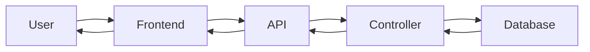

# Spec Template

**Spec ID:** `{spec_id}`  
**Version:** 1.0.0  
**Status:** 📝 Draft | 🚧 In Progress | ✅ Completed | ❌ Cancelled  
**Created:** YYYY-MM-DD  
**Last Updated:** YYYY-MM-DD

---

## 📋 Overview

**Title:** [Feature/Component Name]  
**Type:** Feature | Bug Fix | Enhancement | Refactor | Documentation  
**Priority:** 🔴 Critical | 🟠 High | 🟡 Medium | 🟢 Low

**Purpose:**  
Brief description of what this spec aims to achieve and why it's needed.

**Problem Statement:**  
What problem does this solve? What pain points does it address?

---

## 🎯 Goals

1. **Primary Goal**
   - Clear, measurable objective

2. **Secondary Goals**
   - Supporting objectives
   - Nice-to-have features

3. **Non-Goals**
   - What this spec explicitly does NOT cover
   - Out of scope items

---

## ✅ Acceptance Criteria

### Must Have (Required)
- [ ] Criterion 1: Specific, testable requirement
- [ ] Criterion 2: Another specific requirement
- [ ] Criterion 3: Performance requirement (e.g., < 500ms response time)

### Should Have (Important)
- [ ] Criterion 4: Important but not blocking
- [ ] Criterion 5: User experience improvement

### Nice to Have (Optional)
- [ ] Criterion 6: Enhancement for future
- [ ] Criterion 7: Additional feature

### Test Cases
- [ ] Unit tests pass
- [ ] Integration tests pass
- [ ] Manual testing complete
- [ ] Edge cases handled

---

## 🏗️ Technical Design

### Architecture Overview
```
[Diagram or description of system architecture]
```

### Components

#### 1. Component Name
**Purpose:** What this component does  
**Location:** `path/to/component`  
**Dependencies:** What it depends on

**Interface:**
```typescript
interface ComponentProps {
  prop1: string
  prop2: number
}
```

### Database Changes

#### New Tables
```sql
CREATE TABLE table_name (
  id UUID PRIMARY KEY DEFAULT uuid_generate_v4(),
  column1 VARCHAR(255) NOT NULL,
  column2 JSONB,
  created_at TIMESTAMP DEFAULT NOW(),
  updated_at TIMESTAMP DEFAULT NOW()
);
```

#### New Indexes
```sql
CREATE INDEX idx_table_column ON table_name(column1);
```

### API Endpoints

#### GET /api/resource
**Purpose:** Get list of resources  
**Auth Required:** Yes/No  
**Query Parameters:**
- `limit` (number, optional) - Page size
- `offset` (number, optional) - Pagination offset

**Response:**
```json
{
  "success": true,
  "data": [],
  "count": 10
}
```

#### POST /api/resource
**Purpose:** Create new resource  
**Request Body:**
```json
{
  "field1": "value",
  "field2": 123
}
```

**Response:**
```json
{
  "success": true,
  "data": {
    "id": "uuid",
    "field1": "value",
    "created_at": "timestamp"
  }
}
```

---

## 🔄 Data Flow

1. User action triggers event
2. Frontend validates input
3. API request sent to backend
4. Backend validates and processes
5. Database operation performed
6. Response returned to frontend
7. UI updated with new data



---

## 🔐 Security Considerations

### Authentication & Authorization
- [ ] Endpoint requires authentication
- [ ] User permissions checked
- [ ] Resource ownership verified

### Input Validation
- [ ] All inputs validated on backend
- [ ] SQL injection prevented (parameterized queries)
- [ ] XSS prevention (proper escaping)
- [ ] File upload validation (if applicable)

### Data Protection
- [ ] Sensitive data encrypted
- [ ] No secrets in code
- [ ] Environment variables used
- [ ] Error messages don't leak info

---

## 📊 Performance Requirements

### Response Time
- API response: < 500ms
- Database query: < 100ms
- Page load: < 2 seconds

### Scalability
- Concurrent users: 100+
- Database connections: 20 pool size
- Request rate limit: 100/15min

### Caching
- [ ] Response caching strategy
- [ ] Cache invalidation rules
- [ ] Cache TTL defined

---

## 🧪 Testing Strategy

### Unit Tests
- [ ] Test controller functions
- [ ] Test utility functions
- [ ] Test validation logic
- [ ] Test edge cases

### Integration Tests
- [ ] Test API endpoints
- [ ] Test database operations
- [ ] Test authentication flow

### E2E Tests
- [ ] Test user workflows
- [ ] Test form submissions
- [ ] Test navigation

**Coverage Target:** 80%

---

## 📝 Implementation Notes

### Technical Decisions

#### Decision 1: [Title]
**Context:** Why this decision was needed  
**Options Considered:**
1. Option A - Pros/Cons
2. Option B - Pros/Cons
3. Option C - Pros/Cons

**Decision:** Option B chosen  
**Reasoning:** Why this was the best choice  
**Trade-offs:** What we're giving up

### Dependencies
- Package X version Y.Z
- Service A integration
- External API B

### Known Limitations
- Limitation 1: Description and workaround
- Limitation 2: Future improvement needed

---

## 🚀 Rollout Plan

### Phase 1: Development
- [ ] Implement backend
- [ ] Implement frontend
- [ ] Write tests

### Phase 2: Testing
- [ ] Unit tests pass
- [ ] Integration tests pass
- [ ] Manual QA complete

### Phase 3: Deployment
- [ ] Deploy to staging
- [ ] Smoke test staging
- [ ] Deploy to production
- [ ] Monitor metrics

### Rollback Plan
- If issues found: Revert to previous version
- Database changes: Run rollback migration
- Cache: Clear all caches

---

## 📚 Documentation

### User Documentation
- [ ] Update user guide
- [ ] Add feature to README
- [ ] Create video tutorial (optional)

### Developer Documentation
- [ ] Update API docs
- [ ] Update database schema docs
- [ ] Add code comments
- [ ] Update CHANGELOG

---

## 🔗 Related

- **Parent Spec:** `00_parent.spec`
- **Related Specs:** `02_related.spec`, `03_another.spec`
- **Implementation Plan:** `plans/{spec_id}.plan`
- **Bug Reports:** Issue #123
- **Design Mockups:** Figma link

---

## 📅 Timeline

**Estimated Effort:** X days/weeks  
**Start Date:** YYYY-MM-DD  
**Target Date:** YYYY-MM-DD  
**Actual Completion:** YYYY-MM-DD

---

## ✍️ Stakeholders

**Author:** Developer Name  
**Reviewers:** Reviewer1, Reviewer2  
**Approver:** Product Owner  
**Implementers:** Dev Team

---

## 📊 Success Metrics

### Quantitative
- Metric 1: Target value
- Metric 2: Target value
- Metric 3: Target value

### Qualitative
- User feedback positive
- No critical bugs reported
- Performance meets requirements

---

## 🔄 Review & Updates

| Date | Version | Changes | Updated By |
|------|---------|---------|------------|
| YYYY-MM-DD | 1.0.0 | Initial draft | Author |
| YYYY-MM-DD | 1.1.0 | Added section X | Reviewer |

---

**Maintained By:** Team Name  
**Review Cycle:** Weekly/Monthly  
**Next Review:** YYYY-MM-DD
